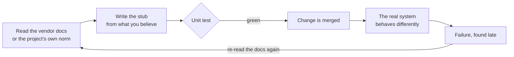
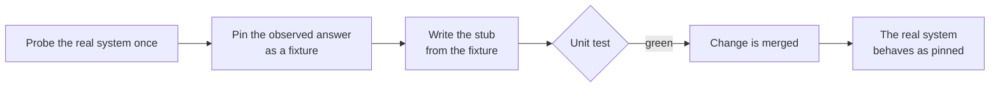

# Skill improvement history — the human-readable edition

> Russian version: [`history.rus.md`](history.rus.md) · Machine-readable version:
> [`../CHANGELOG.md`](../CHANGELOG.md)

`CHANGELOG.md` answers *what changed in which release*. This file answers a
different question: **what was going wrong, why it was wrong, and what the fix
actually does** — in plain words, for a person who was not there.

## How to read this file

Every entry follows the same shape:

| Block | What it gives you |
|---|---|
| **Releases** | every version that carries this change, in one place |
| **In one sentence** | the whole story, if that is all you have time for |
| **AS IS** | what used to happen, as a diagram |
| **TO BE** | what happens now, as a diagram |
| **Example** | the smallest thing you can run yourself to see it |
| **What the skill now says** | the rule in its final wording |
| **Where the rule stops** | the cases it deliberately does not cover |

Three conventions hold everywhere in this file:

1. **One story, one entry.** When the same fix lands in several skills across
   several releases, all of those versions are listed in a single **Releases**
   line. The story is not retold once per skill.
2. **No names of consuming projects.** A defect found while a skill was in use
   is described by its technical content only. Which project ran into it, which
   file it was found in, and that project's internal record identifiers never
   appear here — the same rule applies to `CHANGELOG.md`.
3. **Newest first.** Entries begin at project version 2.7.0; anything older is
   in `CHANGELOG.md` only.

---

## Where a stub gets its truth from

**Releases:** project `2.7.0` · `python-coding` `1.2.0 → 1.3.0`
**Type:** a gap closed — the skill was not wrong, it was silent

### In one sentence

The skill told you **what** to replace with a stub in a unit test, but never
said **where the stub's answers come from** — so a stub could encode a wrong
belief about somebody else's system, and the test would stay green forever.

### The gap, precisely

`references/testing.md` already carried a good rule:

> fake protocols and seams the code exposes, never someone else's internals

That rule is about the **shape** of a stub. It says nothing about the stub's
**content** — the values it hands back. When those values describe a system your
project did not write (a message broker, a database driver, an authentication
encoder), believing them is a leap of faith, and nothing in the skill said so.

### AS IS — how it went wrong



The loop is the damaging part. The stub checks itself: if it lies, the test
lies with it and stays green through any number of fix rounds. Each round
produced a *new reading* of the same documentation, and a new reading is the one
thing that could never settle the question.

### TO BE — how it goes now



One live observation replaces an unbounded number of readings.

### Example you can run in two lines

A connection opened with `psycopg`'s `dict_row` row factory:

| Query | What the driver actually returns |
|---|---|
| `SELECT true AS a, false AS b` | `{"a": True, "b": False}` — two keys |
| `SELECT true, false` (no aliases) | `{"?column?": False}` — **one** key; the columns collapse |

What the test contained:

```python
cursor.fetchone.return_value = (True, False)   # an ordinary DB-API tuple
```

That is what every DB-API tutorial leads you to write, and it is exactly wrong
for a connection using `dict_row` — a choice made by the library, not by the
project. The test passed. The live query raised
`ValueError: not enough values to unpack`.

A second, equally short one:

```python
yarl.URL.build(scheme="amqp", host="h", port=1, user="", password="p").user
# -> None
```

An empty user is indistinguishable from an absent user, so any client library
reading that URL is free to substitute its own default identity. No stub placed
at the wrapper's own seam can see this happen — the stub stands in for the very
layer that does the substituting.

### The same mistake, three times over

| # | Third-party system | What the stub believed | What is actually true |
|---|---|---|---|
| 1 | a message broker, via `aio-pika` | the event name can be read off the routing key | the broker **rewrites** the delivery key at every dead-letter hop, while carrying the message type through untouched |
| 2 | `aiormq`, SASL-PLAIN | "a non-empty string in settings means the login is set" | an empty user counts as absent, and the encoder substitutes a default identity one layer below the seam under test |
| 3 | `psycopg`, `dict_row` | the cursor hands back a tuple | unaliased columns collapse into a single-key mapping |

Three different libraries, three independent occurrences, one shared cause: a
belief about someone else's runtime behaviour was **assumed** instead of
**measured**. Every one of them was settled by a live probe. None was ever
settled by reading.

### What the skill now says

| Rule | In plain words |
|---|---|
| Observation, not reading | For an external system, the stub's return values are established by probing the real thing once — not from vendor prose, not from a project norm |
| Probe first, stub second | Write the stub only after the probe has pinned the behaviour, then reuse that pinned result as a fixture |
| **The second-rejection trigger** | If the same reading of the same external property is rejected twice, stop reading. Switch evidence class: go and measure. Do not produce a third reading |

### Where the rule stops

It applies to systems **you do not own**. A stub for a port your own project
defines is a different matter entirely: there the contract *is* the project's
own decision, and reading it is the correct way to know it. The change ships a
dedicated negative test to keep the rule from being over-applied to that case.

### How the change was made

Test first, in this order: a regression test pinning the new wording was written
and confirmed genuinely red (4 of 5 assertions failing) → the guidance block was
added → the test went green (5 of 5) → two evaluation cases were added, one for
the behaviour and one guarding against the false positive above → the full suite
ran 684 of 684 with no regressions.
