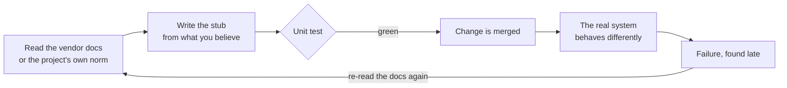
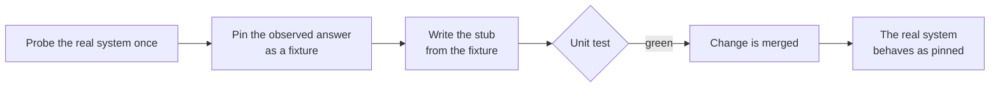
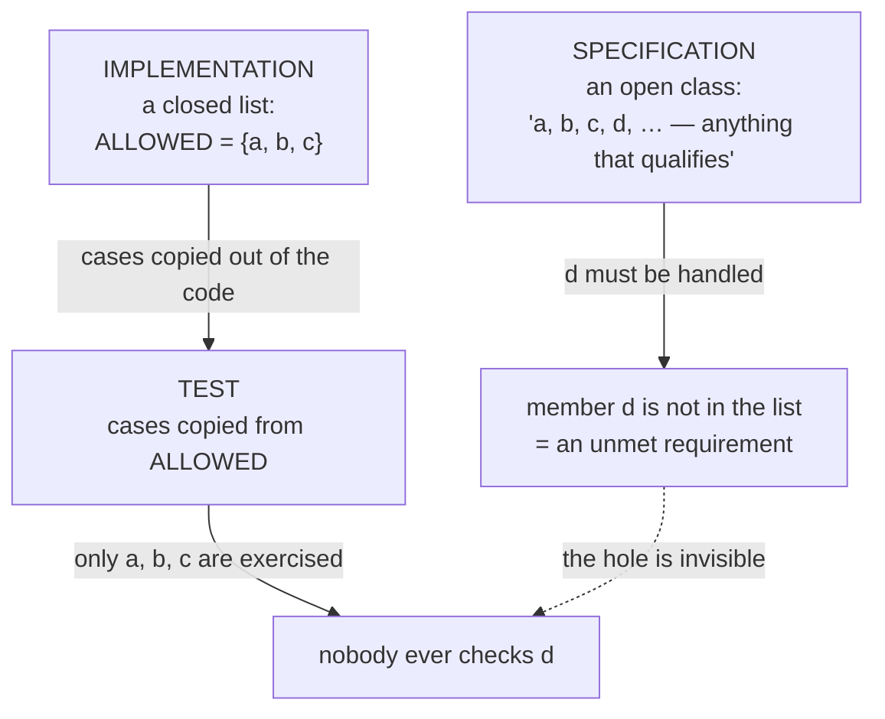
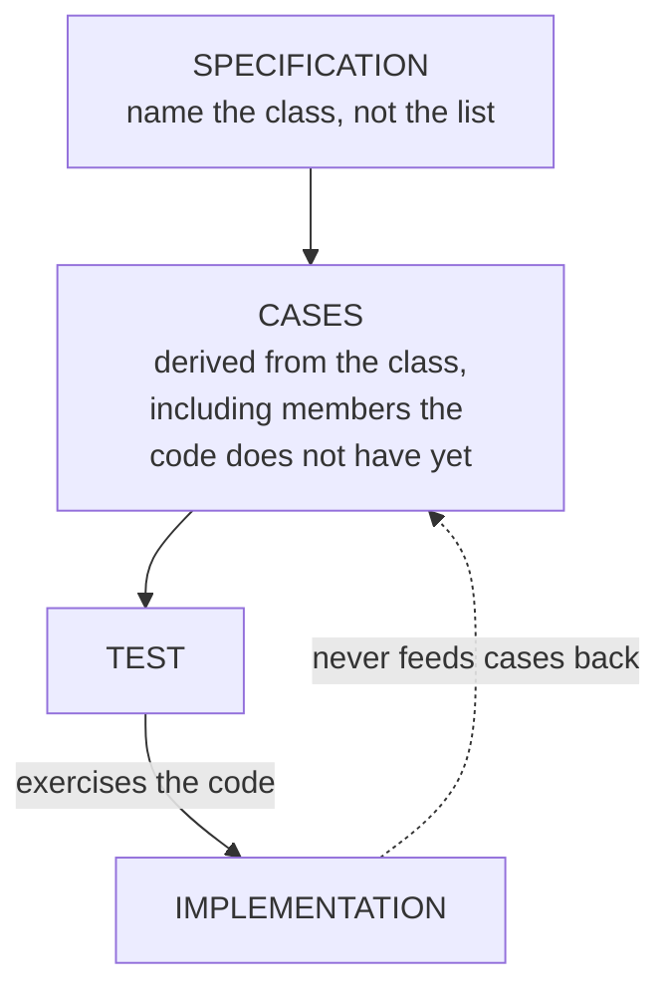
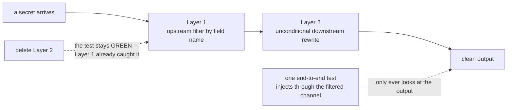

# Skill improvement history — the human-readable edition

> Russian version: [`history.rus.md`](history.rus.md) · Machine-readable version:
> [`../CHANGELOG.md`](../CHANGELOG.md)

`CHANGELOG.md` answers *what changed in which release*. This file answers a
different question: **what was going wrong, why it was wrong, and what the fix
actually does** — in plain words, for a person who was not there.

## How to read this file

Every entry follows the same shape:

| Block | What it gives you |
|---|---|
| **Releases** | every version that carries this change, in one place |
| **In one sentence** | the whole story, if that is all you have time for |
| **AS IS** | what used to happen, as a diagram |
| **TO BE** | what happens now, as a diagram |
| **Example** | the smallest thing you can run yourself to see it |
| **What the skill now says** | the rule in its final wording |
| **Where the rule stops** | the cases it deliberately does not cover |

Three conventions hold everywhere in this file:

1. **One story, one entry.** When the same fix lands in several skills across
   several releases, all of those versions are listed in a single **Releases**
   line. The story is not retold once per skill.
2. **No names of consuming projects.** A defect found while a skill was in use
   is described by its technical content only. Which project ran into it, which
   file it was found in, and that project's internal record identifiers never
   appear here — the same rule applies to `CHANGELOG.md`.
3. **Newest first — the latest entry at the top, a new one added above the
   others.** Same order as `CHANGELOG.md`. The oldest entry covers project
   version 2.5.0; anything older is in `CHANGELOG.md` only.

---

## Where a stub gets its truth from

**Releases:** project `2.8.0` (`typescript-coding` `1.4.0 → 1.5.0`) · project
`2.7.0` (`python-coding` `1.2.0 → 1.3.0`)
**Type:** a gap closed — the skill was not wrong, it was silent

### In one sentence

The skill told you **what** to replace with a stub in a unit test, but never
said **where the stub's answers come from** — so a stub could encode a wrong
belief about somebody else's system, and the test would stay green forever.

### The gap, precisely

`references/testing.md` already carried a good rule:

> fake protocols and seams the code exposes, never someone else's internals

That rule is about the **shape** of a stub. It says nothing about the stub's
**content** — the values it hands back. When those values describe a system your
project did not write (a message broker, a database driver, an authentication
encoder), believing them is a leap of faith, and nothing in the skill said so.

### AS IS — how it went wrong



The loop is the damaging part. The stub checks itself: if it lies, the test
lies with it and stays green through any number of fix rounds. Each round
produced a *new reading* of the same documentation, and a new reading is the one
thing that could never settle the question.

### TO BE — how it goes now



One live observation replaces an unbounded number of readings.

### Example you can run in two lines

A connection opened with `psycopg`'s `dict_row` row factory:

| Query | What the driver actually returns |
|---|---|
| `SELECT true AS a, false AS b` | `{"a": True, "b": False}` — two keys |
| `SELECT true, false` (no aliases) | `{"?column?": False}` — **one** key; the columns collapse |

What the test contained:

```python
cursor.fetchone.return_value = (True, False)   # an ordinary DB-API tuple
```

That is what every DB-API tutorial leads you to write, and it is exactly wrong
for a connection using `dict_row` — a choice made by the library, not by the
project. The test passed. The live query raised
`ValueError: not enough values to unpack`.

A second, equally short one:

```python
yarl.URL.build(scheme="amqp", host="h", port=1, user="", password="p").user
# -> None
```

An empty user is indistinguishable from an absent user, so any client library
reading that URL is free to substitute its own default identity. No stub placed
at the wrapper's own seam can see this happen — the stub stands in for the very
layer that does the substituting.

### The same two facts, in another language

Nothing here belongs to Python. The rule ships in the TypeScript standard too,
with the same two examples restated in the tools a Node project uses:

```ts
new URL("amqp://:p@h:1").username;  // "" — and so is new URL("amqp://h:1").username
```

| What the query looks like | What a driver that builds rows as objects returns |
|---|---|
| `SELECT true AS a, false AS b` | `{ "a": true, "b": false }` — two keys |
| `SELECT true, false` (no aliases) | `{ "?column?": false }` — **one** key; the database names both columns `?column?` and the second overwrites the first |

The language changed; the lesson did not. Which is the point: the rule is about
where a belief comes from, not about a syntax.

### The same mistake, three times over

| # | Third-party system | What the stub believed | What is actually true |
|---|---|---|---|
| 1 | a message broker, via `aio-pika` | the event name can be read off the routing key | the broker **rewrites** the delivery key at every dead-letter hop, while carrying the message type through untouched |
| 2 | `aiormq`, SASL-PLAIN | "a non-empty string in settings means the login is set" | an empty user counts as absent, and the encoder substitutes a default identity one layer below the seam under test |
| 3 | `psycopg`, `dict_row` | the cursor hands back a tuple | unaliased columns collapse into a single-key mapping |

Three different libraries, three independent occurrences, one shared cause: a
belief about someone else's runtime behaviour was **assumed** instead of
**measured**. Every one of them was settled by a live probe. None was ever
settled by reading.

### What the skill now says

| Rule | In plain words |
|---|---|
| Observation, not reading | For an external system, the stub's return values are established by probing the real thing once — not from vendor prose, not from a project norm |
| Probe first, stub second | Write the stub only after the probe has pinned the behaviour, then reuse that pinned result as a fixture |
| **The second-rejection trigger** | If the same reading of the same external property is rejected twice, stop reading. Switch evidence class: go and measure. Do not produce a third reading |

### Where the rule stops

It applies to systems **you do not own**. A stub for a port your own project
defines is a different matter entirely: there the contract *is* the project's
own decision, and reading it is the correct way to know it. The change ships a
dedicated negative test to keep the rule from being over-applied to that case.

### How the change was made

Test first, in this order: a regression test pinning the new wording was written
and confirmed genuinely red (4 of 5 assertions failing) → the guidance block was
added → the test went green (5 of 5) → two evaluation cases were added, one for
the behaviour and one guarding against the false positive above → the full suite
ran 684 of 684 with no regressions.

The TypeScript release repeated the same sequence against its own standard —
red (4 of 5), guidance block, green (5 of 5), two evaluation cases, full suite
703 of 703.

---

## Where a test gets its cases from

**Releases:** project `2.5.0` (`python-coding` `1.1.0 → 1.2.0`) · project
`2.6.0` (`typescript-coding` `1.3.0 → 1.4.0`)
**Type:** a gap closed — one story, two languages, two releases

### In one sentence

The skill checked the **quality** of a test — it must be red before the fix, it
must be deterministic — but said nothing about where the test's **cases come
from**. So cases were copied from the code under test instead of derived from
the specification, and test and code went wrong in the same direction, agreeing
with each other all the way.

### The gap, precisely

The nearest existing rule was:

> Do not tune a test to the gate: never hardcode an expected value "so it
> passes".

It covers none of what actually happened. Nothing was hardcoded to pass; every
case was honestly red before its fix. What was missing was three different
things: **where the cases come from**, **what the test's subject is**, and
**which dimensions it has to vary**.

### AS IS — how a green suite stayed blind



And the trap closes: **mutation testing cannot save you here.** Mutate `ALLOWED`
in the code and the test — copied from `ALLOWED` — mutates with it, goes red,
kills the mutant, and reports a healthy score. In the stricter form, where the
test *imports* the enumeration instead of copying it, the mutation does not even
fail. A healthy mutation score is not evidence of specification coverage.

### TO BE — how it goes now



The arrow from implementation to cases is the one that must not exist.

### Example you can hold in your head

```python
ALLOWED = {"totalTokens", "inputTokens", "outputTokens"}   # the code

@pytest.mark.parametrize("field", ALLOWED)                 # the test
def test_field_is_handled(field): ...
```

The specification says "any token-count field". The code knows three. The test
asks the code which three. A fourth real field — `totalTokenCount` — is handled
by nobody, and no run of this suite will ever say so. The TypeScript shape is
the same: an `as const` registry with `it.each(ALLOWED)` over it.

### The three rules that were added

They ship as one family, under a single thesis: **a test's case set, its
subject and its dimensions are all chosen from the specification, never from
the artifact under test.**

| Rule | In plain words | The mistake it prevents |
|---|---|---|
| **1. Provenance of the case set** | Derive cases from the class the specification names; never copy or parametrize over the code's own list | The suite can only ever confirm what the code already knows |
| **2. Subject under layered protection** | A defence-in-depth claim is unproven until each layer is exercised on a path where it is the **only** protection | One end-to-end test through two layers proves nothing about either |
| **3. Totality across dimensions** | Name the dimensions a guard discriminates on and require at least one case per dimension; a surviving mutant means a missing **dimension**, not just a missing case | 11 cases over 11 names cover one dimension eleven times |

Rule 2, drawn:



Rule 3 in numbers, measured rather than argued: a suite of **303 passing** tests
went to **11 failing** the moment a single case was added that varied the *form*
of a key (raw vs normalized) rather than its *text*. Eleven real holes, one
missing dimension.

### How bad it got before anyone noticed

Nine independent occurrences in one build, over thirteen fix rounds. Every one
was found by a live probe or by a mutation battery — **not once by the suite
that was supposed to be guarding the property**, which stayed green at 133, 247,
251, 276, 303, 320 and 310 passing tests while real defects walked through.

The decisive evidence that this was a missing rule and not a careless author:
two of the nine occurrences appeared **inside the very change that was fixing a
third one** — the pattern reproduced in its own cure, in a round whose author
had just been warned about it and whose test file named the pattern out loud.

### Where the rule stops

Rule 3 is about inputs a guard genuinely discriminates on. An input with one
real dimension needs one dimension's worth of cases and no more; the change
ships a dedicated negative test so the rule is not turned into a demand for
ceremonial cases.

### How the change was made

Test first, both times: a regression pinning the new wording was written and
confirmed genuinely red (5 of 6 assertions failing) → the guidance block was
added → green → evaluation cases, one per rule plus a false-positive guard.
Full suite 673 of 673 for the Python release and 679 of 679 for the TypeScript
one, no regressions. The TypeScript half is a deliberate mirror: same three
rules, examples re-cast in TypeScript idiom (an `as const` registry, `it.each`,
a `Map` with normalized keys, an exhaustive `switch` over a discriminated union
as a second dimension).
