# Skill improvement history — the human-readable edition

> Russian version: [`history.rus.md`](history.rus.md) · Machine-readable version:
> [`../CHANGELOG.md`](../CHANGELOG.md)

`CHANGELOG.md` answers *what changed in which release*. This file answers a
different question: **what was going wrong, why it was wrong, and what the fix
actually does** — in plain words, for a person who was not there.

## How to read this file

Every entry follows the same shape:

| Block | What it gives you |
|---|---|
| **Releases** | every version that carries this change, in one place |
| **In one sentence** | the whole story, if that is all you have time for |
| **AS IS** | what used to happen, as a diagram |
| **TO BE** | what happens now, as a diagram |
| **Example** | the smallest thing you can run yourself to see it |
| **What the skill now says** | the rule in its final wording |
| **Where the rule stops** | the cases it deliberately does not cover |

Three conventions hold everywhere in this file:

1. **One story, one entry.** When the same fix lands in several skills across
   several releases, all of those versions are listed in a single **Releases**
   line. The story is not retold once per skill.
2. **No names of consuming projects.** A defect found while a skill was in use
   is described by its technical content only. Which project ran into it, which
   file it was found in, and that project's internal record identifiers never
   appear here — the same rule applies to `CHANGELOG.md`.
3. **Newest first — the latest entry at the top, a new one added above the
   others.** Same order as `CHANGELOG.md`. The oldest entry covers project
   version 2.5.0; anything older is in `CHANGELOG.md` only.

---

## A completeness check built out of the code it was checking

**Releases:** project `3.13.0` (`typescript-coding` `1.12.0 → 1.13.0`,
`python-coding` `1.10.0 → 1.11.0`)
**Type:** gap closed — both skills explained how to prove a check covers a set
the program itself owns, and said nothing about a set somebody else owns

### In one sentence

If you write the list of cases your code must handle by looking at the cases
your code already handles, the list will always say you are finished — so the
list has to come from whoever owns the set, not from the code under check.

### The gap, precisely

Both skills already carried the easy half. When a set lives inside your own
program — an enumeration, a literal union, the keys of a type — key the table by
that set and assert the two match; add a member and the assertion breaks. That
rule is correct and is untouched here.

The other half was missing entirely. Plenty of sets are owned by something else:
the foreign keys of a database schema, another service's enumeration, a
protocol's message types, the files in a directory, a registry another team
maintains. Neither skill said where the case list for *those* should come from,
and the silence read as "the in-program recipe is the whole rule". Nothing
warned that a list read off your own implementation is circular, and nothing
said the rule applies to a registry or a guard that ships in production code
rather than to a test file.

In the reported occurrence the artifact was a table of foreign-key edges that
drove the order rows were deleted in. Both the delete order and the guard that
was supposed to prove the order complete were written in the same change, by the
same author, from the same source — the code. Three consecutive review rounds
returned a critical failure on that one shape before anybody named it.

### AS IS — how it went wrong

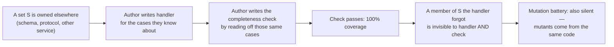

### TO BE — how it goes now

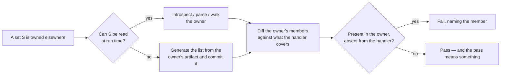

### Example you can run in your head

```python
# The wrong way round: the expectation is copied out of the implementation.
EXPECTED_FK_EDGES = {("order_item", "order"), ("order", "customer")}   # ← typed by hand
assert set(DELETE_ORDER_EDGES) == EXPECTED_FK_EDGES                    # ← always true

# The right way round: the expectation comes from the schema.
declared = introspect_foreign_keys(engine, schema="app")
assert declared - set(DELETE_ORDER_EDGES) == set()
```

Add a third table with a foreign key nobody told the delete order about. The
first version keeps passing forever. The second fails on the next run and names
the edge it found.

### What the skill now says

| Rule | In plain words |
|---|---|
| The set lives in your program | Derive the check from the value itself — an enumeration, a union's tag, `keyof T` |
| The set lives outside your program | Get the list from its owner: introspect the schema, parse the specification, walk the directory — then diff |
| A member in the owner and not in the handler | Is a failure reported by name, never a case quietly skipped |
| A mutation battery is not a substitute | Mutants come from the same code the list was read off, so both share the blind spot |
| It does not have to be a test | A registry, a guard, an allowlist, a coverage table — production code included |
| The owner cannot be read at run time | Generate the list from the owner's artifact at build time and commit it, so drift becomes a diff someone has to accept |

### Where the rule stops

It does not apply to a set whose ground truth genuinely is a value in your own
program — there the existing in-program recipe is right, and a dedicated
negative case pins that the new rule must not be over-applied to it. It also
says nothing about *how* to introspect any particular kind of owner; that is a
property of the schema, protocol or format in front of you, not of this skill.
And pairing the two lists proves the check reads the right source — not that the
handler's behaviour for each case is correct.

### How the change was made

Test first: a regression pinning the new `## Rules` bullet, the new reference
section and every one of its claims was confirmed genuinely red against the
pre-change files, alongside guards that were green throughout (the pre-existing
in-program rule survives untouched; no reporting project's identifiers appear in
either skill) → the minimal delta was added → the regression went green → two
evaluation cases per skill were added, one behaviour and one over-application
guard → the whole library's suite ran with no regressions.

---

## An environment variable named after its caller, and the copy that followed it

**Releases:** project `3.13.0` (`typescript-coding` `1.12.0 → 1.13.0`,
`python-coding` `1.10.0 → 1.11.0`)
**Type:** correction — one item in the duplication survey's decision order
licensed exactly the thing the rest of that file exists to prevent

### In one sentence

If two processes each get their own name for the same credential, the shared
code that reads that credential has nothing left to be parameterized by — so it
gets copied, and the copy is justified by the rule that was supposed to collapse
it.

### The gap, precisely

The decision order tells you that at the third occurrence of one shape you
factor a parameterized home and reduce every caller to the data that genuinely
differs. Its list of such data ended with "an environment-variable key", with no
condition attached.

That reads as permission. And it is the one item on the list that is usually
false: when the callers are separate processes, the variable name is a property
of the **role**, and the differing part is the **value** each process is handed
by whatever starts it. Two names for one role is not parameterization — it is
the thing that makes a single resolver impossible.

Nothing about credential separation requires the names to differ. Distinct
principals stay distinct because they hold distinct values; sharing a spelling
gives no process reach into another's credentials.

### AS IS — how it went wrong

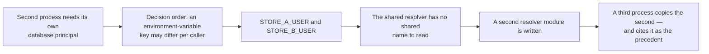

### TO BE — how it goes now

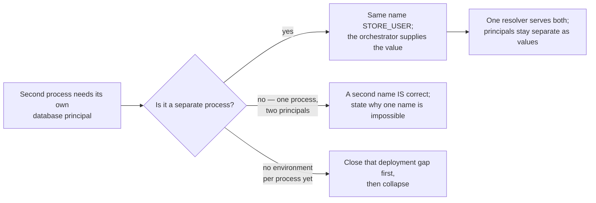

### Example you can run in your head

```
# Before — two names, and therefore two config modules
service-a:  STORE_A_USER=svc_a  STORE_A_PASSWORD=…    → store_a_config
service-b:  STORE_B_USER=svc_b  STORE_B_PASSWORD=…    → store_b_config

# After — one name, two values, one config module
service-a:  STORE_USER=svc_a    STORE_PASSWORD=…  ┐
service-b:  STORE_USER=svc_b    STORE_PASSWORD=…  ┴→ store_config
```

The two principals are exactly as separate afterwards as before: `svc_a` and
`svc_b` are still different accounts with different secrets. What disappeared is
the second copy of the code that reads them.

### What the skill now says

| Rule | In plain words |
|---|---|
| Separate processes | Read the same role-named variable; the orchestrator hands each its own value |
| Separation of principals | Survives as separate **values**, never as separate spellings |
| One process, two principals | Is the case that does warrant a second name — write down what makes one name impossible |
| One shared environment file for everything | Is a deployment gap to close before collapsing, not a naming rule |
| The decision-order item | Now carries its condition in place, so a reader who only skims the list is not misled |

### Where the rule stops

It says nothing about which principals a system should have, how many, or how
their secrets are stored — those are the system's own decisions. It does not
claim a per-caller name is always wrong: the one-process-two-principals case is
named explicitly, and a dedicated negative case pins that the rule must not be
read as banning it. And where there is no per-process environment yet, the
honest reading is that the code is showing you a deployment gap — closing that
gap comes first.

### How the change was made

Test first: a regression pinning the new section, every one of its claims and
the condition now attached to the decision-order item was confirmed genuinely
red against the pre-change files, alongside guards that were green throughout
(both collapse invariants survive untouched) → the minimal delta was added → the
regression went green → two evaluation cases per skill were added, one behaviour
and one over-application guard → the whole library's suite ran with no
regressions.

---

## A duplication rule that told you what got caught, never what to do before you wrote

**Releases:** project `3.12.0` (`typescript-coding` `1.11.0 → 1.12.0`,
`python-coding` `1.9.0 → 1.10.0`)
**Type:** gap closed — both skills' duplication guidance covered only the moment
after a copy already exists; neither ever told an author to look before writing one

### In one sentence

A prior fix in both skills stated exactly what the stack's own tooling does
and does not catch after a duplicate is written; this one adds the step
that comes before all of that — search the tree by shape, extend or call
what is already there, and reach for a new file only once that search
comes back empty.

### The gap, precisely

The prior fix (below) told a reader, correctly, that a clean lint run is
not proof a duplicate is absent. What it left standing in both skills:
`## Workflow` opened directly at typing and style, with no step for
searching the existing tree first, and `## Rules` had a rule about
recognizing a duplicate but none about avoiding writing one. An author
following either skill exactly, from a blank editor, had no instruction
telling them to look before they typed the first line — and measured
evidence from one live tree shows exactly that: a prior de-duplication
task had already extracted three shared pieces of logic into a common
module, and the scaffold around them still stood, duplicated, in ten
further modules — two of the ten token-identical after renaming even
after that extraction — while the correct collapsed shape sat one
directory away, unused as the example it could have been.

### AS IS — how it went wrong

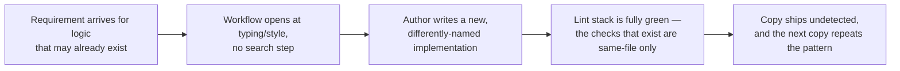

### TO BE — how it goes now

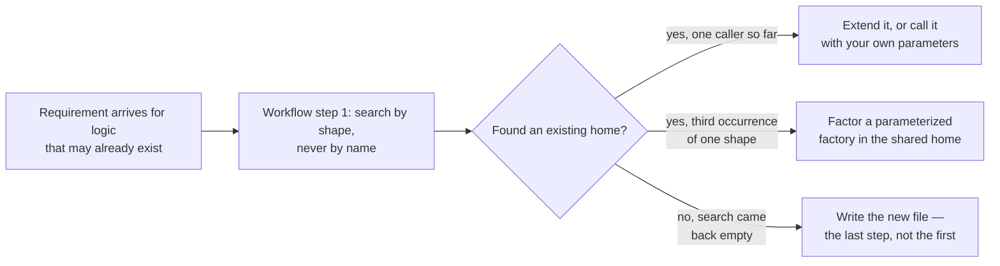

### Example you can run in your head

```ts
// pricing/order.ts — already exists
export function computeOrderTotal(
  items: ReadonlyArray<{ price: number; qty: number }>,
): number {
  return items.reduce((sum, i) => sum + i.price * i.qty, 0);
}
```

A new requirement asks for the identical computation from
`checkout/summary.ts`. Before this delta, nothing in either skill's
workflow points an author back at `pricing/order.ts`; the fastest path is
a fresh `deriveCheckoutTotal` with the same body, renamed — and the four
same-file, textual-identity lint rules the prior fix already documented
stay silent, exactly as advertised. After this delta, workflow step 1 is
the search that finds `computeOrderTotal` before any new code is written,
and the decision order says: call it.

### What the skill now says

| Rule | In plain words |
|---|---|
| Search by shape, never by name | A copy is renamed by construction, so a name search is guaranteed to miss it; search by what the logic is built out of |
| The decision order | Extend the existing home → call it with your own parameters → at the third occurrence of one shape, factor a parameterized home → write a new file only once that search comes back empty |
| A new file is the last step | An absence nobody searched for is not a finding |
| Two invariants a collapse may not weaken | A fail-closed branch keeps a test per caller, not once against the shared helper; a routine defending untrusted input takes the union of every caller's cases, never one caller's slice |

### Where the rule stops

The survey step is not a gate that blocks writing new code — once the
search genuinely comes back empty, writing the new file is the correct
and expected outcome, not a last resort to justify; a dedicated negative
case pins exactly that. Teaching either skill's own bundled convention
checker to perform this search automatically is left undone here — it
needs a structural, cross-file, shape-aware search that a per-file lexical
scanner cannot do.

### How the change was made

Test first: a regression pinning the new `## Workflow` step, the `##
Rules` bullet, the routing-table row, every section of the new
`references/duplication-survey.md`, and the cross-link sentence in
`references/lint-clean.md` was confirmed genuinely red against the
pre-change files (18 of 20 assertions, verified by reverting the content
while keeping the tests) → the minimal guidance was added → the regression
went green → two new evaluation cases per skill (one behavior, one
negative) were added → the skill's own test suite and the whole library's
suite ran with no regressions.

---

## A rule with no check behind it, and a parser that only knew its own caller

**Releases:** project `3.11.0` (`python-coding` `1.8.0 → 1.9.0`)
**Type:** gap closed — a duplication rule with no enforcing check, and a missing rule for sharing a defensive routine across callers

### In one sentence

"No duplicated or identical branches, conditions, or functions" was already
in the skill, unscoped and correct — but nothing said the stack's own
blocking linter cannot check it at all, and nothing told a defensive
routine standing over untrusted input to cover the union of every caller's
cases instead of being copied once per caller.

### The gap, precisely

The first framing of this gap claimed the skill states no
implementation-level duplication rule at all. That claim turned out to be
false: `references/lint-clean.md` already carries the rule, unscoped, in
plain prose. What was genuinely missing, once the false claim was
withdrawn, was narrower and more useful: (a) nothing said that this
stack's blocking linter enforces none of it, and that the advisory
detector which does exist for this class is blind to identifier renaming —
so a green run of both checks is not confirmation; (b) nothing said that a
defensive/parsing routine sitting over untrusted input (a network payload,
an external API's or model's output) needs to be collapsed to one shared
implementation covering the union of every caller's cases, rather than
duplicated per caller with each copy knowing only the cases its own author
tested against.

### AS IS — how it went wrong

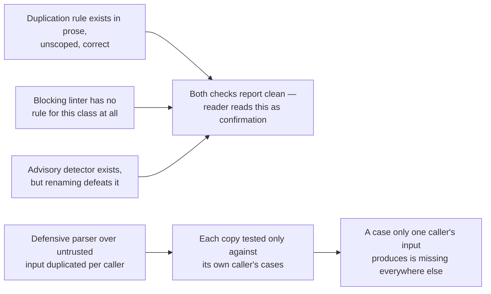

### TO BE — how it goes now

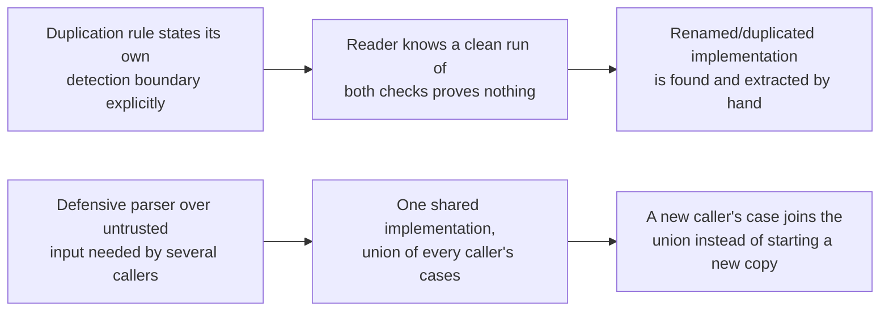

### Example you can run in your head

```python
# pkg_a/adapter.py
def to_int_or_none(raw: object) -> int | None:
    if raw is None:
        return None
    try:
        return int(str(raw))
    except ValueError:
        return None
```

```python
# pkg_b/adapter.py — a different module, the function name and the parameter renamed
def coerce_optional_int(value: object) -> int | None:
    if value is None:
        return None
    try:
        return int(str(value))
    except ValueError:
        return None
```

Run a line-based duplicate-code check (e.g. `pylint`'s `duplicate-code`/
`R0801`) over both: zero findings, `10.00/10` — renaming the function name and the parameter
is enough to make a byte-identical implementation invisible to it. The
stack's blocking linter has no rule of this class at any configuration, so
the class is invisible to the blocking gate unconditionally. Copy the file
verbatim, with no rename, into a third module instead: the same detector
now reports the pair — confirming it was working, and that the rename is
exactly what defeated it.

### What the skill now says

| Rule | In plain words |
|---|---|
| Name the detection boundary | The duplication rule is not backed by the stack's blocking linter, and the advisory detector that exists is blind to renaming — a clean run of both proves nothing |
| State the union rule | A defensive/parsing routine over untrusted input gets one shared home covering the union of every caller's cases, never a copy per caller |

### Where the rule stops

An exact, unrenamed cross-module copy **is** still caught by the advisory
line-based detector today — the new clause narrows what the checks are
credited with, it does not claim they catch nothing; a dedicated negative
case pins that this one case still counts. The union rule applies where a
defensive routine genuinely has more than one caller — a validator with
exactly one caller is not asked to anticipate callers that do not exist,
and a dedicated negative case pins that too. Teaching the skill's own
bundled convention checker to detect cross-file or renamed duplication
itself is left undone here.

### How the change was made

Test first: a regression pinning the new clause in
`references/lint-clean.md`, the new section in `references/security.md`,
and both `SKILL.md` pointer clauses was confirmed genuinely red against the
pre-change files, together with a stdlib-only reproduction of the
union-rule failure mode (two independently-maintained copies of a parser,
each patched only for its own caller's case) that was already green on its
own terms and unaffected by the prose delta → the minimal guidance was
added → the regression went green → four new evaluation cases (two
behavior, two negative) were added → the skill's own test suite and the
whole library's suite ran with no regressions.

---


## A clean lint run that never looked at the other file

**Releases:** project `3.10.0` (`typescript-coding` `1.10.0 → 1.11.0`)
**Type:** gap closed — the duplication rule named its checkers but never their scope, so a green run read as proof of absence

### In one sentence

The four SonarJS/ESLint rules this skill cites for "no duplicated or
identical functions" only ever compare two spots **inside the same file**,
and only when they are **textually identical** — rename one identifier, or
move the copy to a different file, and every one of them goes quiet.

### The gap, precisely

The rule bullet named four checkers and stopped at "factor the shared body
out," with nothing said about what those checkers actually look at. A reader
who follows the skill literally, gets a fully green lint run, and concludes
the codebase has no duplicated implementations is wrong exactly when it
matters most: the checkers were never looking across files, and identifier
renaming defeats them even within one file.

### AS IS — how it went wrong

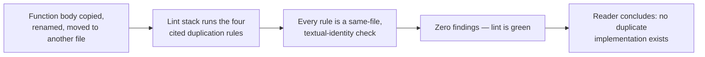

### TO BE — how it goes now

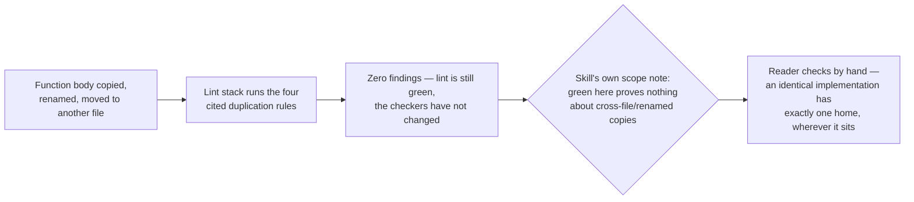

### Example you can run in your head

```ts
// a.ts
export function computeTotal(value: number): number {
  return value * 2 + 1;
}
```

```ts
// b.ts — a different file
export function deriveTotal(input: number): number {
  return input * 2 + 1;   // identical body, function + parameter renamed
}
```

Run `eslint` with `eslint-plugin-sonarjs`'s `no-identical-functions` (and the
other three cited rules) over both files: zero findings, exit `0`. Put the
same two (renamed) bodies in **one** file instead: `no-identical-functions`
still reports nothing — the rename alone is enough, independent of the file
boundary. Only an **exact, unrenamed** copy in the **same** file is caught.

### What the skill now says

| Rule | In plain words |
|---|---|
| Name the scope | The four cited rules are same-file, textual-identity checks; none tolerates a rename and none ever compares two files |
| State the obligation directly | An identical implementation has exactly one home regardless of which file it lives in — a green lint run is not evidence otherwise |

### Where the rule stops

An exact, unrenamed duplicate sitting in the same file **is** caught by
`no-identical-functions` today — the scope note narrows what the family is
credited with, it does not claim the family catches nothing; the skill ships
a dedicated negative case pinning that this one case still counts. Teaching
the skill's own bundled convention checker to detect cross-file or renamed
duplication itself is a separate, larger change, left undone here.

### How the change was made

Test first: a regression pinning the new scope-note text in
`references/lint-clean.md` and its pointer clause in `SKILL.md` was confirmed
genuinely red against the pre-change files, re-executed live against
`eslint` 10.7.0 + `eslint-plugin-sonarjs` 4.2.2 on a four-file scratch tree
to confirm the underlying claim → the minimal delta was added → the
regression went green → one behavior and one negative evaluation case were
added → the skill's own test suite and the whole library's suite ran with no
regressions.

---

## Two correct rules that leak a secret when chained together

**Releases:** project `3.9.0` (`python-coding` `1.7.0 → 1.8.0`)
**Type:** gap closed — two individually-correct rules composed into a disclosure channel neither one named

### In one sentence

"Wrap the cause at most once" and "log the full chain when you finally
report" are each right on their own — but chain a third-party validation
exception that echoes the rejected input in its own text, and reporting "the
full chain" reports that echoed input too, even when the wrapper's own
message never names a value.

### The gap, precisely

A settings-validation boundary follows both rules to the letter: it catches
the library's own validation exception, re-raises a typed error whose message
lists only variable *names*, and chains it with `from err` so the cause
survives. The top-level handler then does exactly what "report with the
stack" asks: it logs the full chain, `__cause__` included. Neither rule is
wrong. The gap is that the *chained* exception is not the author's message —
it is a third-party object whose own `str()`/`repr()` was written for a
library maintainer's debugging convenience, and that convenience routinely
means "show me what was rejected."

### AS IS — how it went wrong

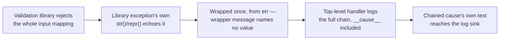

### TO BE — how it goes now

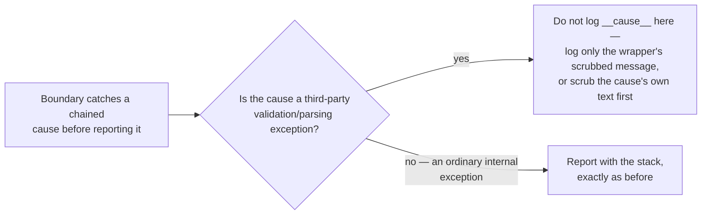

### Example you can run in your head

```python
class SettingsRefused(RuntimeError):
    """Deliberately value-free — names variables, never values."""

try:
    Settings.model_validate(raw_env)          # a third-party validator
except ValidationError as err:                # its str() echoes raw_env
    raise SettingsRefused(
        "invalid configuration: see variable names above"
    ) from err                                # wrap once, preserve the cause
```

```python
except SettingsRefused:
    logger.exception("settings construction failed")   # logs __cause__ too —
                                                         # ValidationError's own
                                                         # text, secrets included
```

`SettingsRefused`'s own message never names a value. The chained
`ValidationError` still does, and `logger.exception` puts it in the record
anyway — a fragment survives even where the library's own `repr` truncates a
long value, which is why the rule anchors on "a fragment reaches the log,"
never on the whole value surviving intact.

### What the skill now says

| Rule | In plain words |
|---|---|
| Name the composition | "Wrap once, preserve the cause" plus "report with the stack" is right for an ordinary exception, wrong once the cause is a third-party validation/parsing exception that echoes untrusted input |
| Two remedies | Either stop logging `__cause__` at that boundary and log only the wrapper's own scrubbed message, or re-render the cause through the project's log-scrubber first |

### Where the rule stops

An ordinary internal exception — one this project's own code raises, whose
text was written by this project's own author — is unaffected: "report with
the stack" still applies exactly as before, and the skill ships a dedicated
negative case so this new rule does not start flagging every chained-and-logged
exception as a leak. Which scrubbing mechanism to use, and whether the
underlying code should also stop echoing the value in the first place, are
left to the host project.

### How the change was made

Test first: a regression pinning the new rule text — plus a stdlib-only,
library-independent reproduction proving the leak is real, whose own
assertion checks for a value-*derived fragment*, never the whole value, since
a real validation library is free to truncate its own `repr` — was confirmed
genuinely red against the pre-change reference file → the minimal guidance
(one new clause in `references/errors-config-logging.md`, one pointer clause
in `SKILL.md`) was added → the regression went green → one behavior and one
negative evaluation case were added → the skill's own test suite and the
whole library's suite ran with no regressions.

---

## A wiring line the coverage report already believed in

**Releases:** project `3.8.0` (`testing-discipline` `1.6.0 → 1.7.0`)
**Type:** gap closed — the previous wiring rule stated *where* to test, not *what counts as testing it*

### In one sentence

A line that only wires a collaborator together — a factory call, the
registration of its teardown — has no return value of its own, so a coverage
report calls it "protected" the instant *any* test walks through it, even a
test that is asserting something else entirely three lines later.

### The gap, precisely

An earlier fix already said: test the production wiring, not a hand-built copy
of it. That is a rule about *which seam* to exercise. It says nothing about
*what it means to have exercised it*. A composition root can pass that rule to
the letter — the real startup path really does run — and still leave a brand
new wiring line completely unchecked, because the test that runs the real path
was written to prove something else.

### AS IS — how it went wrong

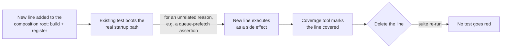

### TO BE — how it goes now

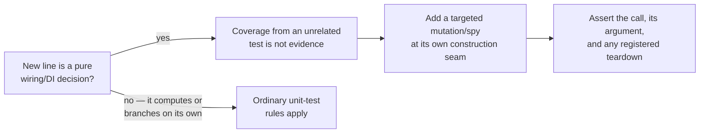

### Example you can run in your head

```python
def _build_lifespan(settings, logger):
    module = build_module(settings, logger=logger)   # <- new line
    stack.callback(module.shutdown)                    # <- new line
    ...

def test_lifespan_wires_the_queue_prefetch_limit():
    with app_lifespan(settings) as state:
        assert state.queue.prefetch_count == settings.prefetch_limit
```

`test_lifespan_wires_the_queue_prefetch_limit` runs the real `_build_lifespan`,
so both new lines execute — the coverage tool sees them go green. Delete either
line and this test still passes: it never looked at `module` or at whether
`shutdown` was ever registered. The fix is a second, targeted test:

```python
def test_lifespan_builds_and_registers_the_module():
    spy = Mock(wraps=build_module)
    with patch("composition_root.build_module", spy):
        with app_lifespan(settings) as state:
            spy.assert_called_once_with(settings, logger=state.logger)
            assert state.module.shutdown in state.exit_stack.callbacks
```

### What the skill now says

| Rule | In plain words |
|---|---|
| A pure wiring/DI line has no return value | Coverage from a test that asserts something else is not protection for it |
| The check is a targeted mutation/spy | Delete or mutate the line itself, at its own construction seam, and assert the call, its argument, and any registered teardown |

### Where the rule stops

A line that computes or branches on its own is not a "pure" wiring line and is
covered by the ordinary unit-test rules, not this one. A wiring line that
already has its own targeted spy test — asserting the call and its teardown
registration directly — is correctly protected and is not flagged again; the
skill ships a dedicated negative case to keep the new rule from over-applying
to a line that is already tested the right way.

### How the change was made

Test first: a regression pinning the new rule text and its own reproduction
was written and confirmed genuinely red against the pre-change reference file
→ the minimal guidance (one new section, one rule-12 clause, one `Rules`
bullet) was added → the regression went green → one behavior and one negative
evaluation case were added → the skill's own test suite and the whole
library's suite ran with no regressions.

---

## A green gate that never said whose model it was green on

**Releases:** project `3.7.0` (`example-skill` `0.3.0`, `hexagonal-service` `2.3.0`, `python-coding` `1.7.0`, `testing-discipline` `1.6.0`, `typescript-coding` `1.10.0`, `typescript-nestjs` `1.3.0`)
**Type:** gap closed — a fact every measurement depended on but nothing recorded

### In one sentence

A skill's eval gate recorded the model and the effort it ran at but never the
vendor those belonged to, and the list of allowed effort levels was frozen in
the runner's own source — so a run could name an environment no supplier could
actually serve, and nothing noticed.

### AS IS

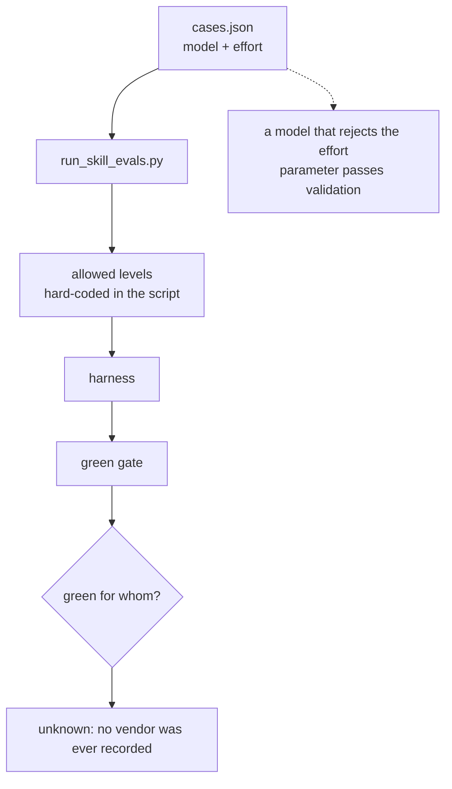

### TO BE

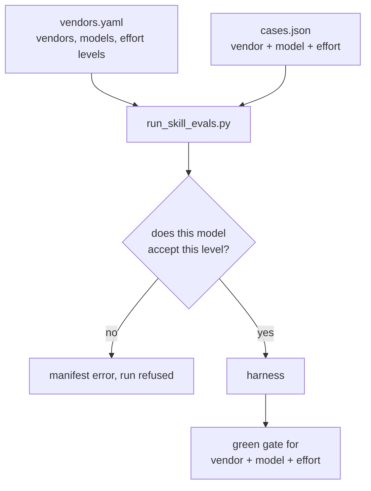

### Example

Before, this was a valid manifest; now it is a refused one:

```bash
$ python3 scripts/run_skill_evals.py --validate-only __test__/evals/example-skill/cases.json
ERROR: tiers.debug: model 'claude-haiku-4-5' takes no effort level at all —
declare a model that does, or run without the effort dial
```

That is not a hypothetical. The first sync of all five vendors found that four
of them carried a wrong fact — including the one that mattered here: the cheap
debug tier every skill declared named a model whose supplier rejects the effort
parameter outright. The tier moved to a model that accepts it, and the saving
now comes from the effort dial rather than from a weaker model.

| Vendor | What the registry believed | What the documentation says |
|---|---|---|
| anthropic | its cheap model takes the effort dial | it rejects the parameter entirely |
| openai | the default level is `none` | the default level is `medium` |
| google | one default for the whole vendor | the default is per model — the lite model starts at the lowest level |
| deepseek | a top-level effort field, no low level | the field is nested, and a low level does exist |
| xai | — | confirmed unchanged |

### What the library now says

| Rule | Where it is enforced |
|---|---|
| A run's environment is a triple: vendor + model + effort | `tiers` in every `cases.json`; all three required |
| Allowed effort levels come from the registry, not from code | `vendors.yaml` → the declared model's own levels |
| A green gate belongs to that triple and to no other | `AGENTS.md`, "Vendor discipline" |
| The effort variable scrubbed from the child environment is the vendor's | `effort_env_var`; a run naming no vendor scrubs them all |
| Every skill carries one adapter per declared vendor, with no rules in it | `skillctl validate`, both directions |
| Vendor facts are refreshed for two reasons only | `vendor add-model` (new model) or `--reason operator-request` |

### When the vendor actually touches the skill

The vendor does not turn up "a bit everywhere". It has four distinct roles, and
in each one it decides strictly its own thing. The clearest way to see it is to
follow a single rule from idea to consumer and mark the points the vendor
touches.

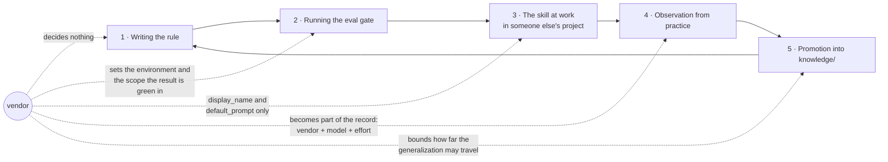

| Moment | What the vendor decides | What it does not decide |
|---|---|---|
| **Writing the rule** | nothing | the text of the rule. A rule is stated neutrally; one that only holds for a single vendor is not a rule yet — it is an observation with a scope |
| **Running the gate** | everything: the run environment is the triple vendor + model + effort, and the registry decides which levels that model has at all | what the rule says. The gate decides **where** it is proved, not **what** is written in it |
| **The skill at work in someone else's project** — it was installed into their repository and an agent is doing work by it | the wrapper only — `agents/<vendor>.yaml`: the name the skill is shown under and the phrasing that invokes it by default | not one line of `SKILL.md` or `references/`. Which model runs is that project's harness's choice; the library takes no part at that moment |
| **Observation (how the skill learns)** | the record's scope: vendor, model family, effort level | the right to rewrite the rule. An observation is a fact about an environment, not a new norm |
| **Promotion into `knowledge/`** | the limit of the generalization: a statement travels exactly as far as it was measured | the appearance of an "on vendor X, do it differently" branch. No such branch enters a skill |
| **Syncing the documentation** | the vendor facts in the registry | not one line of a skill. A sync updates the registry, not the rules |

The third row is the one everything else is for, and the one most often read
wrong. It looks like this: somebody ran `skillctl install` and the skill's files
landed in their repository; a developer opens their agent in **their** project;
the agent reads `SKILL.md` and writes code by its rules. The library is not
present at that moment — it picks neither the model nor the effort level; those
are that project's settings and its harness's.

Hence the consequence that is easy to miss: **a green gate is a record of a
measurement, not a promise to the consumer.** It says "on this triple the rules
were followed" and says nothing about a project that runs the skill on a
different vendor. If that vendor is to be supported in earnest, it is measured
separately — which produces a second record, not a wider reading of the first.

The asymmetry is deliberate and rests on one idea: **the vendor enters a skill
as the scope of the evidence and never as a branch inside a rule.** A branch
would mean the reader of the rule must first work out which vendor they are on —
and a skill is installed one at a time into a project the library knows nothing
about, so there is nobody to ask.

What this looks like in practice. A rule works on one vendor's model and not on
another's. What happens:

1. it is **not** grounds for adding "on vendor X do it differently" to
   `SKILL.md`;
2. it is grounds for an observation candidate in that skill, naming the vendor,
   the model family and the effort level the difference shows up on;
3. then the ordinary review: the observation either becomes verified knowledge
   with an explicit applicability scope, or it does not;
4. and, as a separate step, a measurement on the second triple — if that vendor
   is to be supported at all. Green on one vendor does not carry over to another
   by inference, only by measurement.

### Where the rule stops

The library still never goes online. `skillctl vendor refresh` prints the plan —
which pages to open, which fields to extract, where to put the answer — and
`skillctl vendor apply` records what came back; the trip is made by whoever has
network access. The gate holds a vendor to a completed sync only when it is
marked `in_use: true`; a vendor declared as groundwork is not held to one, even
though all five happen to be synced today. And a synced registry says what a
supplier documents, not what a model does: that is still the eval gate's job,
one triple at a time.

---

## A comment that looked like an annotation

**Releases:** project `3.6.0` (`typescript-coding` `1.8.0 → 1.9.0`)
**Type:** gap closed — a rule the skill relied on but never stated

### In one sentence

A `@typedef` written with `//` line comments is not JSDoc at all — the
compiler, the editor, the declaration emit and the JSDoc linter all walk past
it without a word — so the type check its author believed they had written
never ran, and the skill, which said *what* to document but never in *what
form*, had nothing to say about it.

### The problem, precisely

The JSDoc section of the skill carried two rules, and both of them presuppose
a third one that was never written down:

| What the skill said | What it left open |
|---|---|
| Exported symbols carry a block with a prose description | what makes a comment a *block* |
| Do not restate types in the block — TypeScript is the source of truth | — |

Three ways to write the same annotation, and only one of them exists as far as
the toolchain is concerned:

| Written as | Is it JSDoc? | What the toolchain says |
|---|---|---|
| `/** @type {User} */` | yes | applies the type, and reports it when violated |
| `// @type {User}` | **no** | nothing — anywhere, ever |
| `/* @type {User} */` | **no** | nothing, unless the project turned on `jsdoc/no-bad-blocks` |

Two things make this hard to notice on your own. The failure is *silent in the
direction of success*: no unknown-tag error, no lint finding, just an
annotation that quietly is not there. And the habit that produces it is
learned from directives that genuinely accept a line comment —
`// @ts-expect-error`, `// @ts-check`, `// eslint-disable-next-line` all work
exactly as written. Comment form is decided per directive; nothing announces
which rule you are under.

### AS IS — how it went wrong

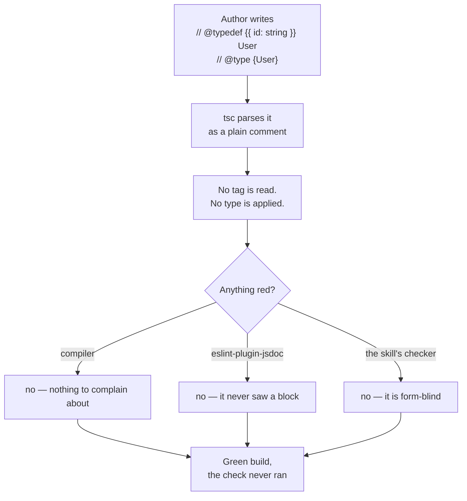

### TO BE — how it goes now

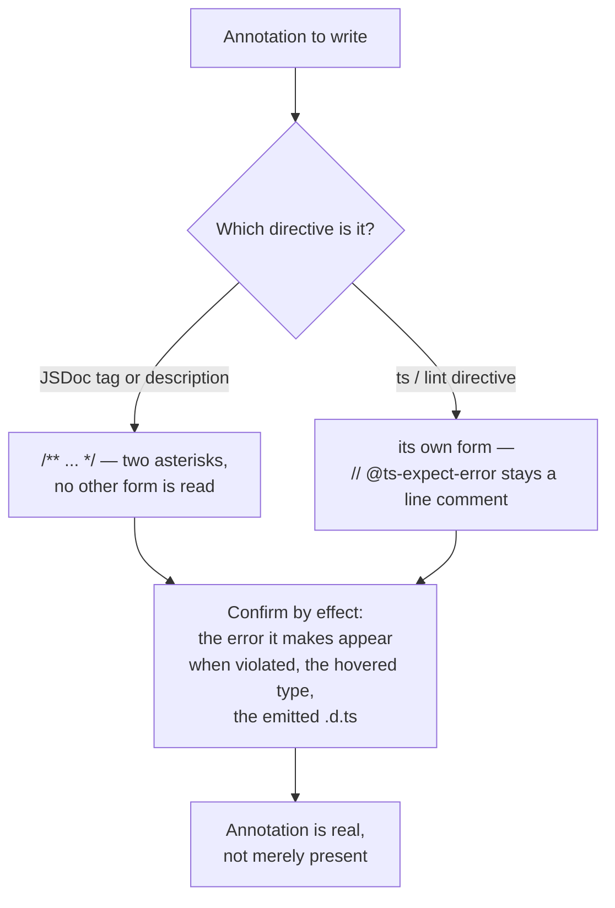

### Example — the same four lines, twice

```js
// @ts-check
// @typedef {{ id: string, name: string }} User
// @type {User}
const user = { id: 1 };
```

`tsc --noEmit --strict --allowJs --checkJs` says **nothing** about `id: 1`.
Move the two tags into a block and the same compiler reports
`TS2322: Type 'number' is not assignable to type 'string'`:

```js
// @ts-check
/** @typedef {{ id: string, name: string }} User */
/** @type {User} */
const user = { id: 1 };
```

The single-star `/* ... */` version of the first snippet is quieter still —
exit code 0, not one diagnostic. And the same split shows up in what you ship:
under `--declaration`, a `/** ... */` description above an exported symbol is
carried into the generated `.d.ts`, while a `//` description above the
identical export is dropped. All three checked on TypeScript 6.0.3.

### What the skill now says

- **JSDoc is a block-comment format** — `/**` … `*/`, two asterisks, nothing
  else. The same tags in `//` line comments, or in a single-star block, are
  not JSDoc: nothing reads them, and nothing reports that nothing read them.
- **It is a defect, not a style deviation.** An inert `@typedef` or `@type`
  takes a type check away with it; the file says so in those words, so a
  reviewer meeting one treats it as a broken check rather than a formatting
  nit.
- **Confirm an annotation by its effect**, never by its presence — the error
  it makes appear when violated, the hovered type, the emitted `.d.ts`.
- **The failure mode is recorded where failures live** (the skill's pitfalls
  file), with the compiler run that establishes it, so the claim can be
  re-executed rather than believed.

### Where the rule stops

- **It is about JSDoc, not about comments.** Directives whose own form is a
  line comment stay line comments — `// @ts-expect-error`, `// @ts-check`,
  `// eslint-disable-next-line`. "Always use a block" would be a different,
  wrong rule.
- **No tool is asked to catch it.** A lint stack can catch the single-star
  half (`jsdoc/no-bad-blocks`, off by default) and nothing catches the `//`
  half; the skill's own checker masks comment text before its rules run and is
  form-blind by construction. Teaching it this rule would mean reworking that
  masker — deliberately left out of this change, to be raised on its own
  evidence.

---

## Five skills, one box each — and the four that could not be shipped alone

**Releases:** project `3.4.0` (`typescript-nestjs` `1.1.1 → 1.2.0`,
`typescript-coding` `1.7.0 → 1.8.0`, `python-coding` `1.5.0 → 1.6.0`,
`hexagonal-service` `2.1.1 → 2.2.0`, `testing-discipline` `1.3.0 → 1.4.0`)
**Type:** coupling removed — every skill made complete on its own

### In one sentence

Skills are installed one at a time, but four of the five had grown
sentences that only work if a *second* skill is installed too — and one of
them sent readers to a skill that had not held the rule in question for
three releases.

### The problem, precisely

A consumer installs `typescript-nestjs` and nothing else. That is a normal
thing to do, and the skill did not survive it:

| What the file said | What the reader got |
|---|---|
| "**Presumes** the hexagonal-service skill … and the typescript-coding skill" | a standard that declares itself incomplete |
| "Universal test hygiene **comes from** the typescript-coding skill" | a pointer to a skill that carries no test rules — they moved out in `3.0.0` |
| "typed domain errors only (**see** hexagonal-service error flow)" | a rule named but never stated |
| "never a raw `process.env` read (the typescript-coding checker flags this as **`TS-ENV`**)" | another checker's rule code, meaningless here |
| "Suppressions follow the **same strict contract as** typescript-coding" | a contract defined by reference |

The other three skills had the milder form of the same thing: a flat
assertion that some rule "lives in" a named sibling — in `SKILL.md`, in
the OpenAI adapter prompt, in a reference file, in a checker comment, in a
dataset contract. Harmless when both skills are attached; a dangling
pointer the rest of the time.

The reason it kept happening is that the obvious fix looks wrong. Two
skills both saying "wrap a foreign error once, at the source, keeping the
cause" reads like duplication to be removed. It is not:

> **Duplication is the price of independence and is fine. A reference is
> not.** What must never differ is the *content* of the two copies —
> contradiction is the real defect, and it is what the gates now look for.

### AS IS — how it went wrong

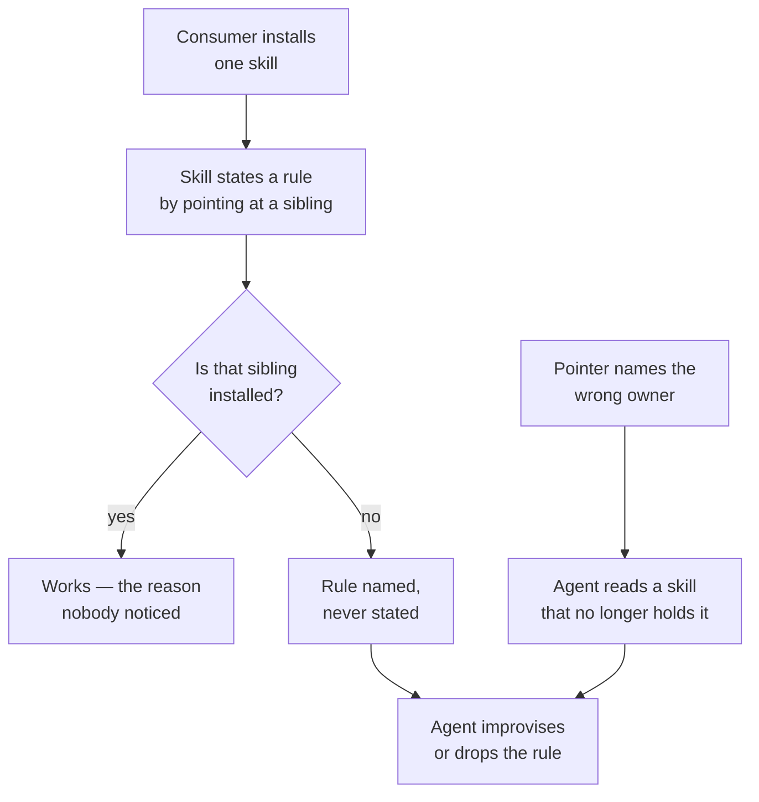

### TO BE — how it goes now

```mermaid
flowchart TD
    A["Consumer installs\none skill"] --> B["Every rule stated in full,\nin this skill's own terms"]
    B --> C["Works alone"]
    C --> D{"Is a sibling\nalso attached?"}
    D -->|"yes"| E["Conditional sentence fires:\n'where the host project also\ndeclares X, apply it on top'"]
    D -->|"no"| F["Same sentence reads as\na no-op — nothing dangles"]
    G["Gate refuses a new\nunconditional mention,\nforeign rule code,\npath or version"] --> B
```

### Example — the same sentence, before and after

```text
before:  Raw `throw new Error` in domain/application is forbidden —
         typed domain errors only (see hexagonal-service error flow).

after:   Raw `throw new Error` in domain/application is forbidden —
         typed domain errors only; a foreign error is wrapped into one
         exactly once, in the driven adapter that received it, with the
         original kept as `cause`.
```

The rule is now in the box the reader opened. A ports-and-adapters
standard says the same thing in its own words, and that is fine — what
would not be fine is the two saying *different* things.

### What the skills now say

- **A sibling may be named in exactly one shape:** a conditional sentence
  — *"where the host project also declares an architecture standard, apply
  it on top"* — which an agent acts on when both skills happen to be
  attached and ignores when they are not.
- **Never another skill's internals:** no rule codes, no file paths, no
  section names, no pinned versions.
- **`typescript-nestjs` decides no test question that belongs to the
  project.** Its testing file had three restatements of universal test
  rules and a hardcoded school ("mock ports" in every unit test); which
  collaborators a unit test replaces is the project's declaration, so the
  file now says so and keeps only what is genuinely NestJS.
- **`hexagonal-service` claims language neutrality and now keeps it** — it
  no longer offers two TypeScript skills as its examples and none for any
  other language.

### Where the rule stops

- **It does not forbid duplication.** The error-wrapping rule, the
  environment rule and the logging rule are stated in several skills on
  purpose; a review checks that the copies agree, not that they are few.
- **It does not reach the observation records.** An accepted observation
  is a dated field report that agents may not edit, so records written
  before this rule keep their wording. What a *new* record may say about a
  sibling is now in `AGENTS.md`, and the authored `observations/INDEX.md`
  is gated like everything else.
- **The gate catches references, not paraphrases.** A rule copied in
  someone else's words still reads as original text; that is a review
  question, and the anti-duplication battery is a backstop for it, not a
  substitute.

---

## A skill that kept growing levels — and the one line it never drew

**Releases:** project `3.3.0` (`testing-discipline` `1.2.0 → 1.3.0`)
**Type:** scope narrowed — one level removed, and the boundary it was hiding given an owner

### In one sentence

The skill had grown a third level of testing it could not support, while the
only boundary its readers actually had to decide — *is this a unit test or an
integration test?* — was described by nobody, so an agent could be told
confidently how to build a deployment skeleton and left guessing about the
test in front of it.

### The problem, precisely

Two failures that look unrelated and are the same failure: **the skill's scope
was set by what got written, not by what it could arbitrate.**

| | What the skill offered | What a reader actually needed |
|---|---|---|
| Exercising a deployed system from outside | a level, an outer loop, deployment advice, suite-splitting rules | nothing — different subjects, lifecycles and owners; the skill has no standing here |
| **Unit versus integration** | three levels each defined by *the question it answers* | **where the line between two of them runs** — which the two schools answer differently |
| London school | a catalog entry naming its cost, plus an outer loop that was mostly about deployment | the unit-level technique: where the doubled collaborators come from |

The middle row is the load-bearing one. "Never let an integration test grow
quietly inside the unit suite" was already a rule — and it presupposes a
boundary the skill never stated. Worse, it *cannot* state one: London draws it
structurally (a real collaborator makes the test an integration test) and the
classical school draws it behaviourally (a shared dependency, slowness, or
more than one unit of behaviour does). A skill that picked one would be
choosing the school it spends four files refusing to choose.

### AS IS — how it went wrong

```mermaid
flowchart TD
    A["Agent asked:\nis this a unit test?"] --> B["Skill offers three levels,\neach defined by its question"]
    B --> C{"Which level\nis this test?"}
    C -->|"'does this object do\nthe right thing?' — fits"| D["Unit"]
    C -->|"'does our code work against\ncode we cannot change?' — also fits"| E["Integration"]
    D --> F["Agent picks one\nand states it confidently"]
    E --> F
    F --> G["The suite splits on\nan unstated boundary"]
    H["Agent asked about\ndeployment testing"] --> I["Skill has a level for it"]
    I --> J["Answers with unit-test\nreasoning: isolate, double,\nrun in milliseconds"]
```

### TO BE — how it goes now

```mermaid
flowchart TD
    A["Agent asked:\nis this a unit test?"] --> B{"What school do the\nproject rules declare?"}
    B -->|"London"| C["Structural line:\nany real collaborator\nmakes it integration"]
    B -->|"Classical"| D["Behavioural line:\nshared dependency, slow,\nor more than one behaviour"]
    B -->|"undeclared"| E["Follow the existing suite,\npropose recording the choice"]
    C --> F["Line is drawn —\nand then enforced"]
    D --> F
    E --> F
    G["Agent asked about\ndeployment testing"] --> H["Out of scope:\nsay so, do not improvise\nfrom unit-test rules"]
```

### Example — one test, two correct verdicts

```python
def test_a_promoted_customer_pays_the_reduced_rate():
    pricer = OrderPricer(DiscountPolicy())     # both ours, both real
    assert pricer.total_for(an_order().promoted()) == 100 * 0.9
```

Nothing external is touched, it runs in microseconds, and it exercises two of
our own classes.

- Under the **classical** school this is a **unit test**: one unit of
  behaviour, no shared dependency, fast.
- Under **London** it is an **integration test**: a real collaborator runs, so
  a red bar has two suspects.

Both verdicts are correct, and they are correct for different projects. Before
this release a reviewer citing the skill could demand the test be moved out of
the fast suite, and an author citing the same skill could refuse — each of them
right, and the skill silent. Now the file says outright that **there is no
level boundary this skill can hand you**, names both readings, and points at
the project's declaration; what does not vary is that once the line is drawn,
it is enforced.

### What the skill now says

- **The scope is unit and integration tests.** It is stated in the
  `description` a caller reads before loading the skill, restated as a rule
  that says to *decline* out-of-scope questions rather than improvise, and
  guarded by a scanner that fails the build if a third level reappears
  anywhere in the skill — with a second test that plants one, so the scanner
  cannot silently stop working.
- **The line between the two levels is the school's, not the skill's.** Each
  school's reading is written out side by side, the project declares which it
  draws, and an undeclared project follows its existing suite rather than a
  guess.
- **London's unit-level technique gets its own file.** A collaborator that
  does not exist yet is named from the point of view of the object that needs
  it — *"if this worked, who would know?"* — and the double in the test is
  what brings it into being. Interfaces are **pulled into existence from the
  client, never pushed out from an implementation**; the discovered surface is
  kept narrow. It ships with the cost it incurs and the rules that pay it
  down, because a project that declares London and skips those has bought the
  cost without the benefit.
- **The cycle narrowed to the test.** The evidence rule, the four-step loop
  and the refactor step stay. Working a written list, sizing a step, the gears
  to green and how to end a session were project workflow rather than
  statements about a unit or integration test, and are gone.
- **An unfinished red test stays in the working copy** until it passes, and
  **no red suite is shared** — which is what the removed in-progress-suite
  carve-out was reaching for, without needing a level to hang it on.

### Where the rule stops

- **Narrowing the scope is not a claim that the removed material was wrong.**
  Walking skeletons, feature-level acceptance loops and the split between a
  progress suite and a regression suite are real practices; they belong to a
  discipline this skill does not carry, and to your project's own rules.
- **"The school decides" is not "anything goes".** The boundary is declared
  once and then enforced exactly as before: a unit test that acquires a real
  connection, file or clock has changed level and is moved, renamed and given
  the lifecycle its level carries.
- **Interface discovery is opt-in.** It applies where the project declares
  London or interaction-based design. Under the classical school the
  collaborators are mostly real and the file does not apply at all.

---

## A test nobody ever watched fail — and the half of testing the skill never described

**Releases:** project `3.2.0` (`testing-discipline` `1.1.0 → 1.2.0`)
**Type:** missing axis added — every rule judged the test, none described how it comes to exist

### In one sentence

The standard could tell you everything about a test except when to write it,
which meant a test that had never once been observed to fail — and therefore
proved nothing — passed every rule the skill had.

### The gap, precisely

Split what a testing standard can say into two columns. The skill had one of
them, in depth, and the other not at all.

| Question | Covered before | |
|---|---|---|
| What shape must the test have? | yes — structure, naming, one act step | ✔ |
| What may it touch, what may it assert? | yes — schools, doubles, boundaries | ✔ |
| Where do its cases come from? | yes — specification, never the artifact | ✔ |
| **When does the test come into being?** | **no** | ✘ |
| **How do I know this test can fail at all?** | **no** | ✘ |
| **Which test do I write next, and how big is the step?** | **no** | ✘ |
| **What do I do when writing the test hurts?** | **no** | ✘ |

The second block is not a nicety. A test is a claim about behaviour, and the
only evidence that the claim is *checkable* is having seen the check fail. The
skill demanded a failing run in exactly one place — a bug fix — and nowhere
else, so its own rule "a test that cannot fail protects nothing" had no
procedure attached to it.

### AS IS — how it went wrong

```mermaid
flowchart LR
    A["Code written"] --> B["Test written after"]
    B --> C["Suite is green"]
    C --> D{"Skill's checks"}
    D -->|"shape ok, naming ok,\ncases from spec"| E["Test accepted"]
    E --> F["Nobody ever saw it red"]
    F --> G["A test that cannot fail\ncounts as protection"]
```

### TO BE — how it goes now

```mermaid
flowchart LR
    A["Test written"] --> B{"Has it been\nseen red?"}
    B -->|"written first"| C["The first run\nis the measurement"]
    B -->|"written after"| D["Break the behaviour\nit names, watch it fail,\nrestore"]
    C --> E{"Red for its\nown reason?"}
    D --> E
    E -->|"yes"| F["Now it is protection"]
    E -->|"no — arrange blew up,\nor green unexpectedly"| G["Investigate before\ncounting it"]
```

### Example — a test that passes for a reason nobody chose

```python
class Expired(Exception):
    pass


class Token:
    def __init__(self, user, expires_at, now):
        if expires_at <= now:          # the constructor also validates
            raise Expired
        self.user, self.expires_at = user, expires_at


def authorize(token, now):
    if token.expires_at <= now:        # the guard under test
        raise Expired
    return Session(token.user)


def test_rejects_an_expired_token():
    with raises(Expired):
        token = Token("u", expires_at=YESTERDAY, now=TODAY)
        authorize(token, now=TODAY)
```

Delete the guard inside `authorize` entirely and this test stays green: the
exception it catches was raised two lines earlier, in the arrange step. It has
the right shape, the right name and a case taken straight from the
specification — every rule the skill had before this release. What exposes it
is watching it run: written first it goes green immediately, which is now an
*unexpected green* to be investigated rather than a small victory; written
last, breaking the guard leaves it green, which is now the missing evidence.

### Four places where the new rules and the old ones look like a contradiction

Adding a process to a standard about artifacts creates collisions. Each pair
below is now separated by an explicit boundary, and each boundary is pinned by
a test, because dropping one is a plausible edit that leaves the skill quietly
self-contradicting.

| The process says | The standard says | Where the line runs |
|---|---|---|
| Reach green by returning a constant, then generalize | Never hardcode a value so a test passes | the constant goes in **production** code and is transient; hardcoding happens **in the test** and stays |
| Write the derivation into the assertion: `100 / 2 * (1 - 0.015)` | Never recompute the expected value with the algorithm under test | it is about *whose* computation: the specification's, in the test's own literals — never the production routine or constant |
| End a solo session with the last test failing | Nothing broken, focused or skipped is committed | the red test lives in the working copy; anything shared is green |
| Classical test-driven development runs inside-out | *(the skill said exactly this)* | that is a contrast with London's outside-in, not the school's own account — its sources reject the vertical metaphor for **known-to-unknown** |

### What the skill now says

- **A test that has never been observed to fail for its own reason is not yet
  evidence.** Free when it is written first; one deliberate break-and-restore
  otherwise. *Which* failure matters — an arrange step that blew up has
  demonstrated nothing about the assertion. An unexpected green is
  investigated, never enjoyed.
- **The red/green/refactor cycle is the project's declaration**, exactly like
  the school: a written test list worked one item at a time, never more than
  one red test at once, the next test chosen for what it teaches against what
  you can confidently pass, a degenerate first case, four gears to green
  (obvious implementation → one-to-many → triangulate → fake it) with a rule
  for changing gear, and step size named as the variable being controlled.
- **A test that is hard to write, slow, or fragile is a report on the design.**
  Long arrange, setup that resists sharing, action at a distance, the urge to
  reach private state — each maps to what it says about the code and the change
  it asks for, under one rule: change the design first, the test second.
- **Smaller rules that came with it:** name the expected value rather than a
  property many wrong answers share; never let one constant mean two things in
  one case; test only what you wrote, calibrating depth by the cost of being
  wrong; delete a test only when it is redundant on *both* confidence and
  communication.

### Where the rule stops

- **The cycle is never imposed.** A project that writes tests immediately after
  each function, deliberately, is doing nothing the skill objects to. Only the
  evidence rule applies unconditionally.
- **The cycle does not reach everywhere.** Security and concurrency cannot be
  demonstrated by passing tests; performance, stress and usability are separate
  activities; a design decided in advance keeps being surprised; and legacy
  code without seams is handled by limiting scope, not by stopping delivery.
- **A painful test is a symptom, not a diagnosis.** It is usually right that
  something is wrong and frequently wrong about what. And when the design idea
  does not come, it does not come — assert the state, record the cost, move on;
  what is forbidden is doing that silently.

---

## "In isolation" means two different things — and now the project says which

**Releases:** project `3.1.0` (`testing-discipline` `1.0.0 → 1.1.0`)
**Type:** hidden assumption removed — a strategy choice was being made silently

### In one sentence

*A unit test runs in isolation* has two established readings — isolate the unit
from its collaborators, or isolate the tests from one another — and the testing
standard quietly assumed the second one, so any project that had deliberately
chosen the first was being reviewed against a convention it never adopted.

### The problem, precisely

The standard's isolation reference contained one sentence that looked like a
clarification and was in fact a decision:

> Isolation is about the *test*, not about purity.

That is the classical (Detroit) school's definition, word for word. Everything a
reviewer does downstream follows from it:

| Question | London (mockist) answers | Classical (Detroit) answers |
|---|---|---|
| What is isolated? | the unit, from its collaborators | the tests, from one another |
| What is a "unit"? | one class | one unit of behaviour — however many classes |
| Which dependencies get a test double? | every mutable collaborator | only shared ones (in practice, out-of-process) |
| What is an integration test? | any test using a real collaborator | one that is slow, shared, or covers two behaviours |
| Which way does test-driven development run? | outside-in | inside-out |

Both columns are coherent, both are in wide use, and the standard was pinned to
the right-hand one without ever saying so. A team on the left-hand column got
advice that contradicted its own convention, and had nothing in the standard to
argue with — because the choice was never presented as a choice.

### AS IS — how it went wrong

```mermaid
flowchart LR
    A["Standard says:\nisolation = between tests"] --> B{"The project's own\nconvention"}
    B -->|"classical"| C["Advice matches\nby luck"]
    B -->|"mockist"| D["Advice contradicts\nthe project"]
    D --> E["No way to argue:\nthe choice is invisible"]
    E --> F["Either the suite drifts\nor the skill is ignored"]
```

### TO BE — how it goes now

```mermaid
flowchart LR
    A["Project rules declare\na school"] -->|"declared"| B["Follow it exactly"]
    A -->|"not declared,\nsuite is consistent"| C["Follow the suite,\npropose recording it"]
    A -->|"nothing to go on"| D["Propose one,\nget it recorded"]
    B --> E["Rules that hold under\nboth schools always apply"]
    C --> E
    D --> E
```

### Example — one test, two correct answers

`OrderService` calls `InventoryStore`, a plain in-memory class the team wrote
itself. What should the unit test do with it?

| The project's declared school | What the test does | Why |
|---|---|---|
| London (mockist) | replaces `InventoryStore` with a double | it is a mutable collaborator, and the unit is the class |
| Classical (Detroit) | uses the real `InventoryStore` | it is private to the test, so it cannot make two tests interfere |

Before this release one of these two answers was silently treated as the wrong
one. Now both are right, and the only question is which one the project wrote
down.

### What the skill now says

- **The school is declared by the host project, never by the skill.** The
  catalog, the vocabulary the choice is made in (shared vs private,
  in- vs out-of-process, managed vs unmanaged, value vs collaborator) and the
  resolution order for an undeclared project all live in the skill; the
  decision does not.
- **What project rules must declare:** the school (and its boundary, if it
  varies by layer), what a unit is here, which dependencies get a double,
  which out-of-process dependencies count as managed and which as unmanaged,
  where an interaction may be asserted, and the direction of test-driven
  development.
- **What holds either way:** never assert an interaction with a stub; an
  interaction that never leaves the application is an implementation detail;
  a double for something you do not own is written against an adapter you do
  own; output verification is preferred by both schools.
- Alongside the schools, the skill gained the judgement the rest of its rules
  serve — the four attributes of a test (protection against bugs, resistance
  to refactoring, feedback speed, maintenance cost, multiplied rather than
  added), the ranking of the three verification styles, what code deserves a
  unit test at all, and a catalog of the classic anti-patterns.

### Where the rule stops

The skill still picks no school for a project that has one, and only *proposes*
one for a project that has none. It says nothing about which runner to use,
which library builds the doubles, or what coverage number the build demands.
And nothing in the catalog licenses asserting an interaction with a stub,
widening a member's visibility for a test, or recomputing an expected value
with the algorithm under test — those stay wrong under both schools.

---

## One rule, two homes — the test rules become a skill of their own

**Releases:** project `3.0.0` (new skill `testing-discipline` `1.0.0` ·
`python-coding` `1.4.0 → 1.5.0` · `typescript-coding` `1.6.0 → 1.7.0`)
**Type:** duplication removed — the same rule was being maintained twice

### In one sentence

How to write a test is a property of tests, not of a programming language —
but each language standard carried its own full copy of those rules, so every
fix had to be made twice, by hand, in two separate releases.

### The problem, precisely

The three most recent test-rule fixes each landed in one standard first and
then had to be mirrored into the other one:

| The rule that was fixed | Landed first | Mirrored later |
|---|---|---|
| Where a test's cases, subject and dimensions come from | project `2.5.0` | project `2.6.0` |
| How a stub's contract for an external system is established | project `2.7.0` | project `2.8.0` |
| Values substituted on the way out, and who builds the collaborator | project `2.9.0` | project `2.10.0` |

Six releases for three rules. Nothing about any of them was
language-specific: each one shipped its own universality check, and the
mirrored copy differed only in which library the example named. The cost was
not just the duplicated work — it was that the two copies could disagree, and
that a third language would have needed a third copy of everything.

### AS IS — how it went wrong

```mermaid
flowchart LR
    A["A test rule is fixed in\none language standard"] --> B["Someone must remember\nthe other standard"]
    B --> C["A second release re-states\nthe same rule in other idiom"]
    C --> D{"Two copies of one rule"}
    D -->|"one gets edited"| E["Wordings drift apart"]
    D -->|"a third language arrives"| F["A third copy is needed"]
```

### TO BE — how it goes now

```mermaid
flowchart LR
    A["A test rule is fixed once,\nin the testing standard"] --> B{"One copy"}
    B --> C["Language standards keep only\na spelling map for their idiom"]
    C --> D["A new language costs\na spelling map, not a rule set"]
```

### Example — what moved and what stayed

The rule and its reproduction are language-neutral, so they moved:

> A fake's own return values, when the property under test belongs to an
> external system, are established by observing that system once, never by
> reading.

What stayed behind in each language standard is only the vocabulary that
expresses it — a row in a table, not a rule:

| What the test needs | Stays in the language standard |
|---|---|
| A stand-in for a seam the project owns | which construct satisfies the declared interface |
| Last-resort patching | which patching facility, and that it needs a justification |
| A skip that must ship | which marker carries the reason |
| A negative type-level assertion | which suppression the checker itself polices |

### What the skills now say

- `testing-discipline` owns the rules: tests ship with the change, one
  scenario per test, isolation and injected time, what may be faked and how a
  fake's contract is justified, evidence collected where the property lives,
  where cases come from, and suite hygiene.
- `python-coding` and `typescript-coding` keep a spelling map each and no
  longer state test rules of their own.

### Where the rule stops

The testing standard says nothing about which runner to use, where test files
live, or what coverage number the build demands — those belong to the project.
Which collaborator is faked at which seam in a ports-and-adapters codebase
still belongs to `hexagonal-service`, and how a rule is written in a given
language still belongs to that language's standard.

---

## What a stub still can't see — two more shapes of the same blind spot

**Releases:** project `2.10.0` (`typescript-coding` `1.5.0 → 1.6.0`) · project
`2.9.0` (`python-coding` `1.3.0 → 1.4.0`)
**Type:** a gap widened — the previous fix's own scope sentence was too narrow

### In one sentence

The rule about faking a third-party seam said "the stub's **return values** are
established by observing the real system" — but a stub can also miss a value the
real system changes on the way **out** of a call, and it can also miss whether the
*product itself* ever builds the collaborator the way the stub assumed.

### The gap, precisely

The previous entry fixed *how a stub's return values become known to be true*.
Its own wording, read literally, only covers a stub computing the wrong **output**
for a given input. Two adjacent shapes fall outside that wording on a first read:

1. **Nothing comes back at all.** Some third-party clients substitute a value the
   caller does not fully control — a request id, a retry token, a default header —
   on the way *out* of a call, before anything returns. A stub bound at exactly
   that layer has no return value to check, so the "check the return value" framing
   does not put a reader on notice.
2. **The stub built the thing itself.** A test asserting *how* a collaborator is
   constructed — which arguments, which hooks — sometimes builds that collaborator
   by hand inside the test, instead of calling the one production factory that
   really builds it. The test can prove the property is *possible*; it proves
   nothing about whether the *product* does it.

### AS IS — how it went wrong

```mermaid
flowchart LR
    A["Adapter passes a value to\nthe third-party client"] --> B["Client silently substitutes\nits own value on the way out"]
    B --> C["Test fakes the client method\nthat performs the substitution"]
    C --> D{"Unit test"}
    D -->|"green"| E["Value never verified\nto reach the wire"]

    F["Production factory wires\nan argument onto the client"] --> G["Test builds its own\nclient instance instead"]
    G --> H{"Unit test"}
    H -->|"green"| I["Factory's own wiring\nnever exercised"]
```

Both loops share one shape: the evidence the test collects is gathered somewhere
other than where the property under test actually lives.

### TO BE — how it goes now

```mermaid
flowchart LR
    A["Ask: is there a return\nvalue to check at all?"] -->|"no — it's substituted on the way out"| B["Probe the real client once;\npin what actually reaches the wire"]
    A -->|"yes"| C["Existing rule applies:\nprobe, then reuse as a fixture"]

    D["Ask: does the test build\nthe collaborator itself?"] -->|"yes"| E["Exercise the production\nfactory instead"]
    D -->|"no — factory is exercised"| F["Test is measuring\nthe right code path"]
```

### Example you can run in your head

A test faking a third-party client:

```python
monkeypatch.setattr(sdk.chat, "completions", fake_domain)
assert request.trace_id == "t-1"          # true — but never observed
```

This only checks what the caller *passed in*. It says nothing about what the SDK
did with it after that — and the SDK in question regenerated its own id on every
call, unconditionally. The fake stood in for exactly the code that would have
shown that.

The wiring case is shorter still: a factory function is the only place a client
gets built for real use; every test builds a parallel client of its own. Delete
the argument from the factory call, and the whole suite — every test file — stays
green, because none of them ever call the factory.

### The same two shapes, in another language

Neither shape belongs to Python. Both rules ship in the TypeScript standard too,
restated in the tools a Node project uses:

```ts
const send = jest.fn();
client.send = send;
expect(send.mock.calls[0][0].traceId).toBe("t-1");  // what was passed in — never what left
```

```ts
createClient({ interceptors: [logging] });     // the one place the product builds a client
new SdkClient({ interceptors: [logging] });    // what every test builds instead
```

An options object instead of keyword arguments, an interceptor array instead of a
list — the same construction seam, and the same question: is the thing under test
the one that ships?

### What the skill now says

| Rule | In plain words |
|---|---|
| Outbound substitution counts too | A fake must also be checked for a value the real layer changes on the way out, not only for what it returns — there may be no return value to inspect at all |
| Construction is a code path too | A test asserting how a collaborator is built must exercise the production factory, never a hand-built copy — a hand-built copy proves the property achievable, not that the product achieves it |

### Where the rule stops

Neither addition reaches further than its own shape. A fake for a project-owned
seam with no outbound call is unaffected by the first rule. A test that calls the
real production factory directly — not a substitute — already satisfies the
second rule; it is not asked to do anything more. Both additions ship a dedicated
negative test to keep them from being over-applied.

### How the change was made

Test first: a regression pinning the two new rules and their two reproductions
was written and confirmed genuinely red against the pre-change text → the minimal
guidance was added → the regression went green → two behavior and two negative
evaluation cases were added, one pair per shape → the full suite ran with no
regressions.

---

## Where a stub gets its truth from

**Releases:** project `2.8.0` (`typescript-coding` `1.4.0 → 1.5.0`) · project
`2.7.0` (`python-coding` `1.2.0 → 1.3.0`)
**Type:** a gap closed — the skill was not wrong, it was silent

### In one sentence

The skill told you **what** to replace with a stub in a unit test, but never
said **where the stub's answers come from** — so a stub could encode a wrong
belief about somebody else's system, and the test would stay green forever.

### The gap, precisely

`references/testing.md` already carried a good rule:

> fake protocols and seams the code exposes, never someone else's internals

That rule is about the **shape** of a stub. It says nothing about the stub's
**content** — the values it hands back. When those values describe a system your
project did not write (a message broker, a database driver, an authentication
encoder), believing them is a leap of faith, and nothing in the skill said so.

### AS IS — how it went wrong

```mermaid
flowchart LR
    A["Read the vendor docs<br/>or the project's own norm"] --> B["Write the stub<br/>from what you believe"]
    B --> C{"Unit test"}
    C -->|"green"| D["Change is merged"]
    D --> E["The real system<br/>behaves differently"]
    E --> F["Failure, found late"]
    F -->|"re-read the docs again"| A
```

The loop is the damaging part. The stub checks itself: if it lies, the test
lies with it and stays green through any number of fix rounds. Each round
produced a *new reading* of the same documentation, and a new reading is the one
thing that could never settle the question.

### TO BE — how it goes now

```mermaid
flowchart LR
    A["Probe the real system once"] --> B["Pin the observed answer<br/>as a fixture"]
    B --> C["Write the stub<br/>from the fixture"]
    C --> D{"Unit test"}
    D -->|"green"| E["Change is merged"]
    E --> F["The real system<br/>behaves as pinned"]
```

One live observation replaces an unbounded number of readings.

### Example you can run in two lines

A connection opened with `psycopg`'s `dict_row` row factory:

| Query | What the driver actually returns |
|---|---|
| `SELECT true AS a, false AS b` | `{"a": True, "b": False}` — two keys |
| `SELECT true, false` (no aliases) | `{"?column?": False}` — **one** key; the columns collapse |

What the test contained:

```python
cursor.fetchone.return_value = (True, False)   # an ordinary DB-API tuple
```

That is what every DB-API tutorial leads you to write, and it is exactly wrong
for a connection using `dict_row` — a choice made by the library, not by the
project. The test passed. The live query raised
`ValueError: not enough values to unpack`.

A second, equally short one:

```python
yarl.URL.build(scheme="amqp", host="h", port=1, user="", password="p").user
# -> None
```

An empty user is indistinguishable from an absent user, so any client library
reading that URL is free to substitute its own default identity. No stub placed
at the wrapper's own seam can see this happen — the stub stands in for the very
layer that does the substituting.

### The same two facts, in another language

Nothing here belongs to Python. The rule ships in the TypeScript standard too,
with the same two examples restated in the tools a Node project uses:

```ts
new URL("amqp://:p@h:1").username;  // "" — and so is new URL("amqp://h:1").username
```

| What the query looks like | What a driver that builds rows as objects returns |
|---|---|
| `SELECT true AS a, false AS b` | `{ "a": true, "b": false }` — two keys |
| `SELECT true, false` (no aliases) | `{ "?column?": false }` — **one** key; the database names both columns `?column?` and the second overwrites the first |

The language changed; the lesson did not. Which is the point: the rule is about
where a belief comes from, not about a syntax.

### The same mistake, three times over

| # | Third-party system | What the stub believed | What is actually true |
|---|---|---|---|
| 1 | a message broker, via `aio-pika` | the event name can be read off the routing key | the broker **rewrites** the delivery key at every dead-letter hop, while carrying the message type through untouched |
| 2 | `aiormq`, SASL-PLAIN | "a non-empty string in settings means the login is set" | an empty user counts as absent, and the encoder substitutes a default identity one layer below the seam under test |
| 3 | `psycopg`, `dict_row` | the cursor hands back a tuple | unaliased columns collapse into a single-key mapping |

Three different libraries, three independent occurrences, one shared cause: a
belief about someone else's runtime behaviour was **assumed** instead of
**measured**. Every one of them was settled by a live probe. None was ever
settled by reading.

### What the skill now says

| Rule | In plain words |
|---|---|
| Observation, not reading | For an external system, the stub's return values are established by probing the real thing once — not from vendor prose, not from a project norm |
| Probe first, stub second | Write the stub only after the probe has pinned the behaviour, then reuse that pinned result as a fixture |
| **The second-rejection trigger** | If the same reading of the same external property is rejected twice, stop reading. Switch evidence class: go and measure. Do not produce a third reading |

### Where the rule stops

It applies to systems **you do not own**. A stub for a port your own project
defines is a different matter entirely: there the contract *is* the project's
own decision, and reading it is the correct way to know it. The change ships a
dedicated negative test to keep the rule from being over-applied to that case.

### How the change was made

Test first, in this order: a regression test pinning the new wording was written
and confirmed genuinely red (4 of 5 assertions failing) → the guidance block was
added → the test went green (5 of 5) → two evaluation cases were added, one for
the behaviour and one guarding against the false positive above → the full suite
ran 684 of 684 with no regressions.

---

## Where a test gets its cases from

**Releases:** project `2.5.0` (`python-coding` `1.1.0 → 1.2.0`) · project
`2.6.0` (`typescript-coding` `1.3.0 → 1.4.0`)
**Type:** a gap closed — one story, two languages, two releases

### In one sentence

The skill checked the **quality** of a test — it must be red before the fix, it
must be deterministic — but said nothing about where the test's **cases come
from**. So cases were copied from the code under test instead of derived from
the specification, and test and code went wrong in the same direction, agreeing
with each other all the way.

### The gap, precisely

The nearest existing rule was:

> Do not tune a test to the gate: never hardcode an expected value "so it
> passes".

It covers none of what actually happened. Nothing was hardcoded to pass; every
case was honestly red before its fix. What was missing was three different
things: **where the cases come from**, **what the test's subject is**, and
**which dimensions it has to vary**.

### AS IS — how a green suite stayed blind

```mermaid
flowchart TD
    SPEC["SPECIFICATION<br/>an open class:<br/>'a, b, c, d, … — anything that qualifies'"]
    IMPL["IMPLEMENTATION<br/>a closed list:<br/>ALLOWED = {a, b, c}"]
    TEST["TEST<br/>cases copied from ALLOWED"]
    GAP["member d is not in the list<br/>= an unmet requirement"]
    BLIND["nobody ever checks d"]

    SPEC -->|"d must be handled"| GAP
    IMPL -->|"cases copied out of the code"| TEST
    TEST -->|"only a, b, c are exercised"| BLIND
    GAP -.->|"the hole is invisible"| BLIND
```

And the trap closes: **mutation testing cannot save you here.** Mutate `ALLOWED`
in the code and the test — copied from `ALLOWED` — mutates with it, goes red,
kills the mutant, and reports a healthy score. In the stricter form, where the
test *imports* the enumeration instead of copying it, the mutation does not even
fail. A healthy mutation score is not evidence of specification coverage.

### TO BE — how it goes now

```mermaid
flowchart TD
    SPEC["SPECIFICATION<br/>name the class, not the list"]
    CASES["CASES<br/>derived from the class,<br/>including members the code does not have yet"]
    TEST["TEST"]
    IMPL["IMPLEMENTATION"]
    SPEC --> CASES --> TEST
    TEST -->|"exercises the code"| IMPL
    IMPL -.->|"never feeds cases back"| CASES
```

The arrow from implementation to cases is the one that must not exist.

### Example you can hold in your head

```python
ALLOWED = {"totalTokens", "inputTokens", "outputTokens"}   # the code

@pytest.mark.parametrize("field", ALLOWED)                 # the test
def test_field_is_handled(field): ...
```

The specification says "any token-count field". The code knows three. The test
asks the code which three. A fourth real field — `totalTokenCount` — is handled
by nobody, and no run of this suite will ever say so. The TypeScript shape is
the same: an `as const` registry with `it.each(ALLOWED)` over it.

### The three rules that were added

They ship as one family, under a single thesis: **a test's case set, its
subject and its dimensions are all chosen from the specification, never from
the artifact under test.**

| Rule | In plain words | The mistake it prevents |
|---|---|---|
| **1. Provenance of the case set** | Derive cases from the class the specification names; never copy or parametrize over the code's own list | The suite can only ever confirm what the code already knows |
| **2. Subject under layered protection** | A defence-in-depth claim is unproven until each layer is exercised on a path where it is the **only** protection | One end-to-end test through two layers proves nothing about either |
| **3. Totality across dimensions** | Name the dimensions a guard discriminates on and require at least one case per dimension; a surviving mutant means a missing **dimension**, not just a missing case | 11 cases over 11 names cover one dimension eleven times |

Rule 2, drawn:

```mermaid
flowchart LR
    IN["a secret arrives"] --> L1["Layer 1<br/>upstream filter by field name"]
    L1 --> L2["Layer 2<br/>unconditional downstream rewrite"]
    L2 --> OUT["clean output"]
    T["one end-to-end test<br/>injects through the filtered channel"] -.->|"only ever looks at the output"| OUT
    DEL["delete Layer 2"] -.->|"the test stays GREEN —<br/>Layer 1 already caught it"| L1
```

Rule 3 in numbers, measured rather than argued: a suite of **303 passing** tests
went to **11 failing** the moment a single case was added that varied the *form*
of a key (raw vs normalized) rather than its *text*. Eleven real holes, one
missing dimension.

### How bad it got before anyone noticed

Nine independent occurrences in one build, over thirteen fix rounds. Every one
was found by a live probe or by a mutation battery — **not once by the suite
that was supposed to be guarding the property**, which stayed green at 133, 247,
251, 276, 303, 320 and 310 passing tests while real defects walked through.

The decisive evidence that this was a missing rule and not a careless author:
two of the nine occurrences appeared **inside the very change that was fixing a
third one** — the pattern reproduced in its own cure, in a round whose author
had just been warned about it and whose test file named the pattern out loud.

### Where the rule stops

Rule 3 is about inputs a guard genuinely discriminates on. An input with one
real dimension needs one dimension's worth of cases and no more; the change
ships a dedicated negative test so the rule is not turned into a demand for
ceremonial cases.

### How the change was made

Test first, both times: a regression pinning the new wording was written and
confirmed genuinely red (5 of 6 assertions failing) → the guidance block was
added → green → evaluation cases, one per rule plus a false-positive guard.
Full suite 673 of 673 for the Python release and 679 of 679 for the TypeScript
one, no regressions. The TypeScript half is a deliberate mirror: same three
rules, examples re-cast in TypeScript idiom (an `as const` registry, `it.each`,
a `Map` with normalized keys, an exhaustive `switch` over a discriminated union
as a second dimension).
