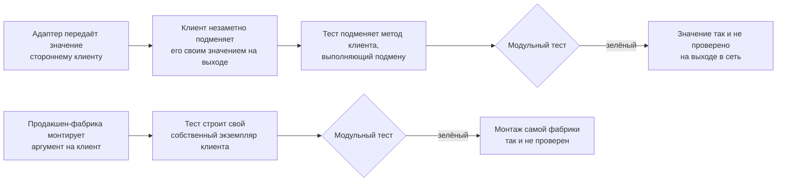
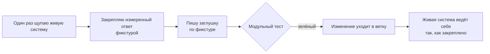
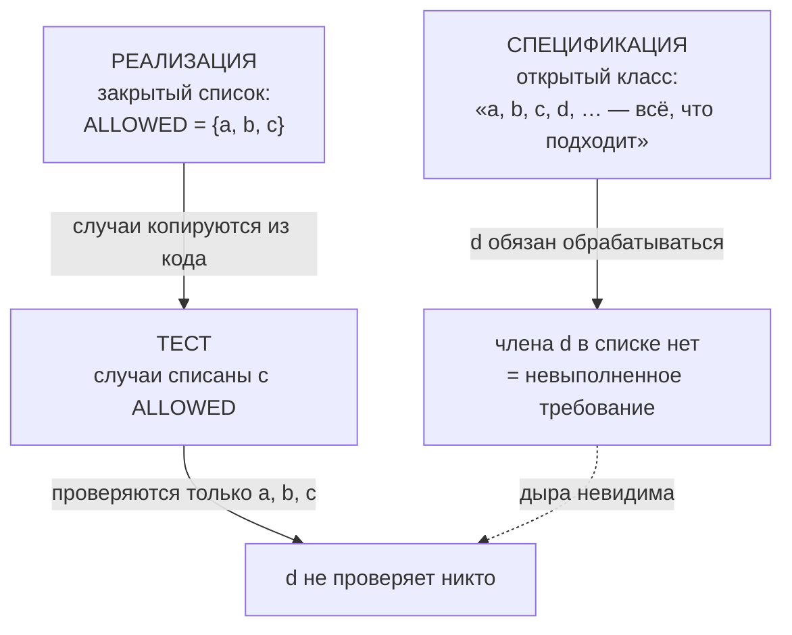
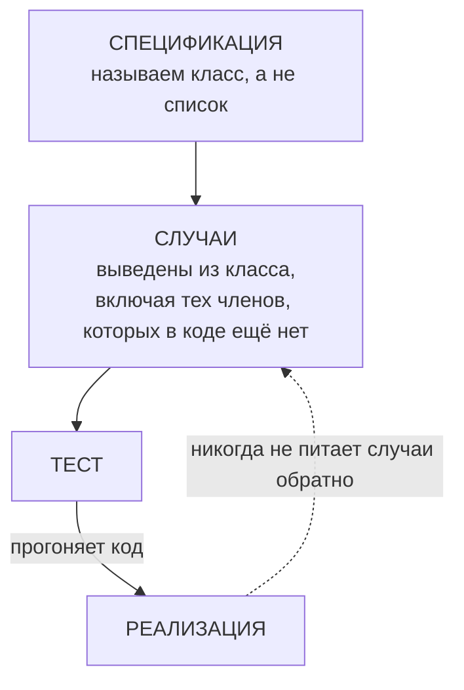
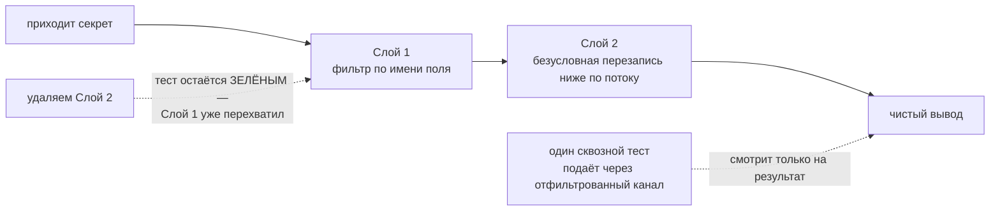

# История улучшений skills — версия для человека

> English version: [`history.eng.md`](history.eng.md) · Машинная версия:
> [`../CHANGELOG.md`](../CHANGELOG.md)

`CHANGELOG.md` отвечает на вопрос «что изменилось в каком релизе». Этот файл
отвечает на другой: **что шло не так, почему это было неправильно и что именно
делает исправление** — простыми словами, для человека, которого при этом не
было.

## Как читать этот файл

Каждая запись устроена одинаково:

| Блок | Что даёт |
|---|---|
| **Релизы** | все версии, которые несут это изменение, в одном месте |
| **Одной фразой** | вся суть, если больше читать некогда |
| **КАК БЫЛО** | что происходило раньше, схемой |
| **КАК СТАЛО** | что происходит теперь, схемой |
| **Пример** | самое короткое, что можно запустить и увидеть самому |
| **Что теперь говорит навык** | правило в окончательной формулировке |
| **Где правило кончается** | случаи, которые оно намеренно не покрывает |

Три соглашения действуют по всему файлу:

1. **Одна история — одна запись.** Если одно и то же исправление попадает в
   несколько навыков и несколько релизов, все эти версии перечисляются одной
   строкой **Релизы**. Историю не пересказывают заново для каждого навыка.
2. **Никаких имён проектов-потребителей.** Дефект, найденный при использовании
   навыка, описывается только по технической сути. Какой проект на него
   наткнулся, в каком файле это было и как называются внутренние записи того
   проекта — здесь не появляется никогда; то же правило действует для
   `CHANGELOG.md`.
3. **Новое сверху — свежая запись добавляется над остальными.** Тот же порядок,
   что в `CHANGELOG.md`. Самая старая запись — версия проекта 2.5.0; всё, что
   старше, есть только в `CHANGELOG.md`.

---

## Чего заглушка всё ещё не видит — ещё две формы того же слепого пятна

**Релизы:** проект `2.9.0` (`python-coding` `1.3.0 → 1.4.0`)
**Тип:** пробел расширен — формулировка предыдущего исправления оказалась узкой

### Одной фразой

Правило про подмену стороннего шва говорило: «**возвратные значения** заглушки
устанавливаются наблюдением за реальной системой» — но заглушка может также
не заметить значение, которое реальная система меняет **на выходе** вызова, и
не заметить, строит ли **сам продукт** объект-соучастник так, как заглушка
предполагала.

### В чём именно был пробел

Предыдущая запись исправила *то, как возвратные значения заглушки становятся
достоверно известными*. Её собственная формулировка, при буквальном чтении,
покрывает только случай, когда заглушка вычисляет неверный **выход** для
данного входа. Две смежные формы остаются вне этой формулировки при первом
прочтении:

1. **Возврата вообще нет.** Некоторые сторонние клиенты подменяют значение,
   которое вызывающая сторона не полностью контролирует, — идентификатор
   запроса, токен повтора, заголовок по умолчанию — на выходе из вызова, до
   того как что-либо возвращается. Заглушка, привязанная ровно к этому слою,
   не имеет возвратного значения для проверки, поэтому формулировка «проверь
   возвратное значение» не предупреждает читателя.
2. **Заглушка построила объект сама.** Тест, проверяющий *как* строится
   соучастник — какие аргументы, какие перехватчики, — иногда строит этого
   соучастника вручную внутри теста, вместо вызова той единственной
   продакшен-фабрики, которая строит его по-настоящему. Такой тест доказывает,
   что свойство *достижимо*; он не доказывает, что его достигает *продукт*.

### КАК БЫЛО — как это ломалось



Обе петли устроены одинаково: доказательства, которые собирает тест, взяты не
там, где на самом деле находится проверяемое свойство.

### КАК СТАЛО — как это работает теперь


### Пример, который можно прокрутить в голове

Тест, подменяющий стороннего клиента:

```python
monkeypatch.setattr(sdk.chat, "completions", fake_domain)
assert request.trace_id == "t-1"          # верно — но никогда не проверено
```

Это проверяет только то, что *передал* вызывающий код. Ничего не говорится о
том, что SDK сделал со значением дальше — а тот SDK безусловно перегенерировал
собственный идентификатор при каждом вызове. Заглушка подменила ровно тот код,
который мог бы это показать.

Случай с монтажом ещё короче: функция-фабрика — единственное место, где клиент
собирается по-настоящему; каждый тест строит свой параллельный клиент. Удалите
аргумент из вызова фабрики — и весь набор тестов, каждый файл, останется
зелёным, потому что ни один из них фабрику не вызывает.

### Что теперь говорит навык

| Правило | Простыми словами |
|---|---|
| Подмена на выходе тоже считается | Заглушку нужно проверять и на значение, которое реальный слой меняет на выходе, а не только на то, что она возвращает — возвратного значения для проверки может не быть вовсе |
| Монтаж — тоже путь кода | Тест, проверяющий, как собран соучастник, должен выполнять продакшен-фабрику, а не собранную вручную копию — вручную собранная копия доказывает достижимость свойства, а не то, что его достигает продукт |

### Где правило кончается

Ни одно из дополнений не выходит за пределы своей формы. Заглушка для шва,
которым владеет сам проект, без вызова наружу, первым правилом не затрагивается.
Тест, вызывающий настоящую продакшен-фабрику напрямую — а не её замену, — уже
удовлетворяет второму правилу; от него не требуется ничего сверх этого. Оба
дополнения несут отдельный негативный тест, чтобы их не применяли шире, чем
нужно.

### Как делалось изменение

Сначала тест: регрессия, фиксирующая два новых правила и обе их
воспроизводимости, была написана и подтверждённо красной на тексте до
изменения → добавлено минимальное руководство → регрессия стала зелёной →
добавлены два `behavior`- и два `negative`-кейса оценки, по паре на форму →
весь набор тестов прошёл без регрессий.

---

## Откуда заглушка берёт правду

**Релизы:** проект `2.8.0` (`typescript-coding` `1.4.0 → 1.5.0`) · проект
`2.7.0` (`python-coding` `1.2.0 → 1.3.0`)
**Тип:** закрыт пробел — навык не ошибался, он молчал

### Одной фразой

Навык говорил, **что** подменять заглушкой в модульном тесте, но не говорил,
**откуда берутся ответы самой заглушки**, — поэтому заглушка могла хранить
неверное представление о чужой системе, а тест оставался зелёным сколько угодно
долго.

### В чём именно был пробел

В `references/testing.md` уже было хорошее правило:

> подменяй протоколы и стыки, которые код открывает сам, а не чужие внутренности

Это правило про **форму** заглушки. Про её **содержимое** — про значения,
которые она возвращает, — там не было ничего. А когда эти значения описывают
систему, которую ваш проект не писал (брокер сообщений, драйвер базы, кодировщик
аутентификации), верить им — акт веры, и навык об этом не предупреждал.

### КАК БЫЛО — как это ломалось


Самое вредное здесь — петля. Заглушка проверяет сама себя: если она врёт, тест
врёт вместе с ней и остаётся зелёным через любое число раундов правок. Каждый
раунд рождал **новое прочтение** той же документации, а новое прочтение — ровно
то единственное, что не могло закрыть вопрос.

### КАК СТАЛО — как это работает теперь



Одно живое наблюдение заменяет неограниченное число прочтений.

### Пример на две строки

Соединение открыто драйвером `psycopg` с фабрикой строк `dict_row`:

| Запрос | Что драйвер возвращает на самом деле |
|---|---|
| `SELECT true AS a, false AS b` | `{"a": True, "b": False}` — два ключа |
| `SELECT true, false` (без псевдонимов) | `{"?column?": False}` — **один** ключ, колонки схлопнулись |

Что было написано в тесте:

```python
cursor.fetchone.return_value = (True, False)   # обычный кортеж DB-API
```

Именно так подсказывает любой учебник по DB-API — и именно это неверно для
соединения с `dict_row`, потому что `dict_row` выбрала библиотека, а не проект.
Тест проходил. Живой запрос падал с
`ValueError: not enough values to unpack`.

Второй пример, такой же короткий:

```python
yarl.URL.build(scheme="amqp", host="h", port=1, user="", password="p").user
# -> None
```

Пустой пользователь неотличим от отсутствующего, поэтому любая клиентская
библиотека, читающая такой URL, вправе подставить собственную личность по
умолчанию. Никакая заглушка на стыке самой обёртки этого не увидит — заглушка
как раз и стоит вместо того слоя, который подставляет.

### Те же два факта на другом языке

Ничто из этого не принадлежит Python. То же правило вошло и в стандарт
TypeScript — с теми же двумя примерами, пересказанными инструментами Node:

```ts
new URL("amqp://:p@h:1").username;  // "" — ровно как и new URL("amqp://h:1").username
```

| Как выглядит запрос | Что вернёт драйвер, собирающий строки объектами |
|---|---|
| `SELECT true AS a, false AS b` | `{ "a": true, "b": false }` — два ключа |
| `SELECT true, false` (без псевдонимов) | `{ "?column?": false }` — **один** ключ: база называет обе колонки `?column?`, и вторая затирает первую |

Язык поменялся, урок — нет. В этом и суть: правило про то, откуда берётся
убеждение, а не про синтаксис.

### Одна и та же ошибка, три раза подряд

| № | Чужая система | Во что верила заглушка | Как на самом деле |
|---|---|---|---|
| 1 | брокер сообщений через `aio-pika` | имя события можно взять из ключа маршрутизации | брокер **переписывает** ключ доставки на каждом переходе в очередь недоставленных, а тип сообщения проносит неизменным |
| 2 | `aiormq`, SASL-PLAIN | «непустая строка в настройках = логин задан» | пустой пользователь считается отсутствующим, и кодировщик подставляет личность по умолчанию слоем ниже проверяемого стыка |
| 3 | `psycopg`, `dict_row` | курсор отдаёт кортеж | колонки без псевдонимов схлопываются в отображение с одним ключом |

Три разные библиотеки, три независимых случая, одна общая причина: убеждение о
поведении чужой системы **предположили**, а не **измерили**. Каждый случай
закрыла живая проба. Ни один не закрыло чтение.

### Что теперь говорит навык

| Правило | Простыми словами |
|---|---|
| Наблюдение, а не чтение | Для чужой системы значения заглушки устанавливаются одной пробой живой системы — не из документации вендора и не из нормы проекта |
| Сначала проба, потом заглушка | Заглушку пишут только после того, как проба закрепила поведение; закреплённый результат дальше переиспользуют фикстурой |
| **Триггер второго отказа** | Если одно и то же прочтение одного и того же чужого свойства отвергли дважды — перестань читать. Смени класс доказательства: иди и померь. Третьего прочтения не бывает |

### Где правило кончается

Оно про системы, **которыми вы не владеете**. Заглушка для порта, который
определил ваш собственный проект, — совсем другой случай: там контракт и есть
решение проекта, и прочитать его — правильный способ его узнать. В изменение
входит отдельный негативный тест, чтобы правило не растянули и на этот случай.

### Как делалось изменение

Строго тестом вперёд: сначала написан регрессионный тест на новую формулировку и
подтверждено, что он по-настоящему красный (падали 4 утверждения из 5) → добавлен
блок правил → тест позеленел (5 из 5) → добавлены два оценочных кейса, один на
поведение и один против ложного срабатывания выше → полный прогон 684 из 684 без
регрессий.

---

## Откуда тест берёт свои случаи

**Релизы:** проект `2.5.0` (`python-coding` `1.1.0 → 1.2.0`) · проект
`2.6.0` (`typescript-coding` `1.3.0 → 1.4.0`)
**Тип:** закрыт пробел — одна история, два языка, два релиза

### Одной фразой

Навык проверял **качество** теста — красный до фикса, детерминированный — но
молчал о том, **откуда берутся случаи** для проверки. Поэтому случаи списывали с
проверяемого кода вместо того, чтобы выводить их из спецификации, и тест с кодом
ошибались в одну сторону, всё время соглашаясь друг с другом.

### В чём именно был пробел

Ближайшее существовавшее правило звучало так:

> Не подгоняй тест под гейт: никогда не зашивай ожидаемое значение, «чтобы
> прошло».

Оно не покрывает ничего из случившегося. Ничего не зашивали «чтобы прошло» —
каждый случай был честно красным до своего фикса. Не хватало трёх других вещей:
**откуда берутся случаи**, **что является предметом теста** и **какие измерения
он обязан варьировать**.

### КАК БЫЛО — как зелёный набор оставался слепым



И ловушка захлопывается: **мутационное тестирование здесь не спасает.**
Мутируешь `ALLOWED` в коде — вместе с ним мутирует и тест, списанный с
`ALLOWED`, он краснеет, мутант убит, скор «здоровый». А в строгой форме, где
тест **импортирует** перечисление вместо копии, мутация даже не падает. Здоровый
мутационный скор — не доказательство покрытия спецификации.

### КАК СТАЛО — как это работает теперь



Стрелка от реализации к случаям — ровно та, которой быть не должно.

### Пример, который умещается в голове

```python
ALLOWED = {"totalTokens", "inputTokens", "outputTokens"}   # код

@pytest.mark.parametrize("field", ALLOWED)                 # тест
def test_field_is_handled(field): ...
```

Спецификация говорит «любое поле со счётчиком токенов». Код знает три. Тест
спрашивает у кода, какие именно три. Четвёртое реальное поле —
`totalTokenCount` — не обрабатывает никто, и ни один прогон этого набора об этом
не скажет. В TypeScript форма та же: реестр `as const` и `it.each(ALLOWED)` по
нему.

### Три правила, которые добавили

Они идут одной семьёй под общим тезисом: **набор случаев теста, его предмет и
его измерения выбираются из спецификации, а не из проверяемого артефакта.**

| Правило | Простыми словами | Какую ошибку закрывает |
|---|---|---|
| **1. Происхождение набора случаев** | Выводи случаи из класса, названного спецификацией; никогда не копируй список из кода и не параметризуйся по нему | Набор способен подтвердить только то, что код и так знает |
| **2. Предмет при слоистой защите** | Заявка «защита в несколько слоёв» не доказана, пока каждый слой не пройден на пути, где он — **единственная** защита | Один сквозной тест через два слоя не доказывает ничего ни об одном |
| **3. Тотальность по измерениям** | Назови измерения, которые различает защитник, и требуй хотя бы один случай на измерение; выживший мутант — признак недостающего **измерения**, а не просто случая | 11 случаев на 11 имён покрывают одно измерение одиннадцать раз |

Правило 2, нарисованное:



Правило 3 в цифрах — измеренных, а не заявленных: набор из **303 зелёных**
тестов превратился в **11 упавших** в тот момент, когда добавили единственный
случай, варьирующий **форму** ключа (сырая против нормализованной), а не его
текст. Одиннадцать настоящих дыр, одно недостающее измерение.

### До чего дошло, пока никто не замечал

Девять независимых вхождений в одной сборке за тринадцать раундов правки. Каждое
нашла живая проба или мутационная батарея — **ни одного не нашёл набор тестов**,
который и должен был стеречь это свойство: он оставался зелёным на 133, 247,
251, 276, 303, 320 и 310 проходящих тестах, пока реальные дефекты шли насквозь.

Решающая улика, что это отсутствующее правило, а не невнимательный автор: два
вхождения из девяти появились **внутри той самой правки, которая чинила
третье** — паттерн воспроизвёлся в лекарстве от самого себя, в раунде, автора
которого только что предупредили, и чей тест-файл называет паттерн вслух.

### Где правило кончается

Правило 3 — про входы, которые защитник действительно различает. Входу с одним
настоящим измерением хватает случаев на одно измерение и не больше; в изменение
входит отдельный негативный тест, чтобы правило не превратилось в требование
обрядовых случаев.

### Как делалось изменение

Тестом вперёд, оба раза: сначала регрессионный тест на новую формулировку,
подтверждённо красный (падали 5 утверждений из 6) → добавлен блок правил →
зелёный → оценочные кейсы, по одному на правило плюс страж от ложного
срабатывания. Полный прогон: 673 из 673 для Python-релиза и 679 из 679 для
TypeScript-релиза, без регрессий. TypeScript-половина — сознательное зеркало: те
же три правила, примеры пересказаны идиомами TypeScript (реестр `as const`,
`it.each`, `Map` с нормализацией ключей, исчерпывающий `switch` по дискриминанту
как второе измерение).
