# История улучшений skills — версия для человека

> English version: [`history.eng.md`](history.eng.md) · Машинная версия:
> [`../CHANGELOG.md`](../CHANGELOG.md)

`CHANGELOG.md` отвечает на вопрос «что изменилось в каком релизе». Этот файл
отвечает на другой: **что шло не так, почему это было неправильно и что именно
делает исправление** — простыми словами, для человека, которого при этом не
было.

## Как читать этот файл

Каждая запись устроена одинаково:

| Блок | Что даёт |
|---|---|
| **Релизы** | все версии, которые несут это изменение, в одном месте |
| **Одной фразой** | вся суть, если больше читать некогда |
| **КАК БЫЛО** | что происходило раньше, схемой |
| **КАК СТАЛО** | что происходит теперь, схемой |
| **Пример** | самое короткое, что можно запустить и увидеть самому |
| **Что теперь говорит навык** | правило в окончательной формулировке |
| **Где правило кончается** | случаи, которые оно намеренно не покрывает |

Три соглашения действуют по всему файлу:

1. **Одна история — одна запись.** Если одно и то же исправление попадает в
   несколько навыков и несколько релизов, все эти версии перечисляются одной
   строкой **Релизы**. Историю не пересказывают заново для каждого навыка.
2. **Никаких имён проектов-потребителей.** Дефект, найденный при использовании
   навыка, описывается только по технической сути. Какой проект на него
   наткнулся, в каком файле это было и как называются внутренние записи того
   проекта — здесь не появляется никогда; то же правило действует для
   `CHANGELOG.md`.
3. **Новое сверху — свежая запись добавляется над остальными.** Тот же порядок,
   что в `CHANGELOG.md`. Самая старая запись — версия проекта 2.5.0; всё, что
   старше, есть только в `CHANGELOG.md`.

---

## Пять навыков, каждый в своей коробке — и четыре, которые нельзя было поставить поодиночке

**Релизы:** проект `3.4.0` (`typescript-nestjs` `1.1.1 → 1.2.0`,
`typescript-coding` `1.7.0 → 1.8.0`, `python-coding` `1.5.0 → 1.6.0`,
`hexagonal-service` `2.1.1 → 2.2.0`, `testing-discipline` `1.3.0 → 1.4.0`)
**Тип:** убрана связанность — каждый навык сделан самодостаточным

### В одном предложении

Навыки ставят по одному, но у четырёх из пяти завелись фразы, которые
работают, только если установлен *второй* навык, — а один из них отправлял
читателя к навыку, который уже три релиза как не содержит нужного правила.

### В чём именно была проблема

Потребитель ставит `typescript-nestjs` и больше ничего. Это обычный
сценарий, и навык его не переживал:

| Что говорил файл | Что получал читатель |
|---|---|
| «**Presumes** the hexagonal-service skill … and the typescript-coding skill» | стандарт, который сам объявляет себя неполным |
| «Universal test hygiene **comes from** the typescript-coding skill» | указатель на навык, где тестовых правил нет — они уехали в `3.0.0` |
| «typed domain errors only (**see** hexagonal-service error flow)» | правило названо, но не сформулировано |
| «never a raw `process.env` read (the typescript-coding checker flags this as **`TS-ENV`**)» | код правила чужого чекера, здесь бессмысленный |
| «Suppressions follow the **same strict contract as** typescript-coding» | контракт, заданный ссылкой |

У остальных трёх навыков была мягкая форма того же самого: утверждение, что
некое правило «живёт» в названном соседе, — в `SKILL.md`, в промпте
OpenAI-адаптера, в reference-файле, в комментарии чекера, в контракте
датасета. Безвредно, когда подключены оба; в остальное время — висячий
указатель.

Держалось это потому, что очевидное лечение выглядит неправильным. Два
навыка, одинаково говорящие «оборачивай чужую ошибку ровно один раз, в
месте возникновения, сохраняя причину», читаются как дублирование, которое
надо убрать. Это не так:

> **Дублирование — цена автономности, и это нормально. Ссылка — нет.**
> Расходиться не должно *содержание* двух копий: настоящий дефект —
> противоречие, и именно его теперь ищут гейты.

### КАК БЫЛО — как это ломалось

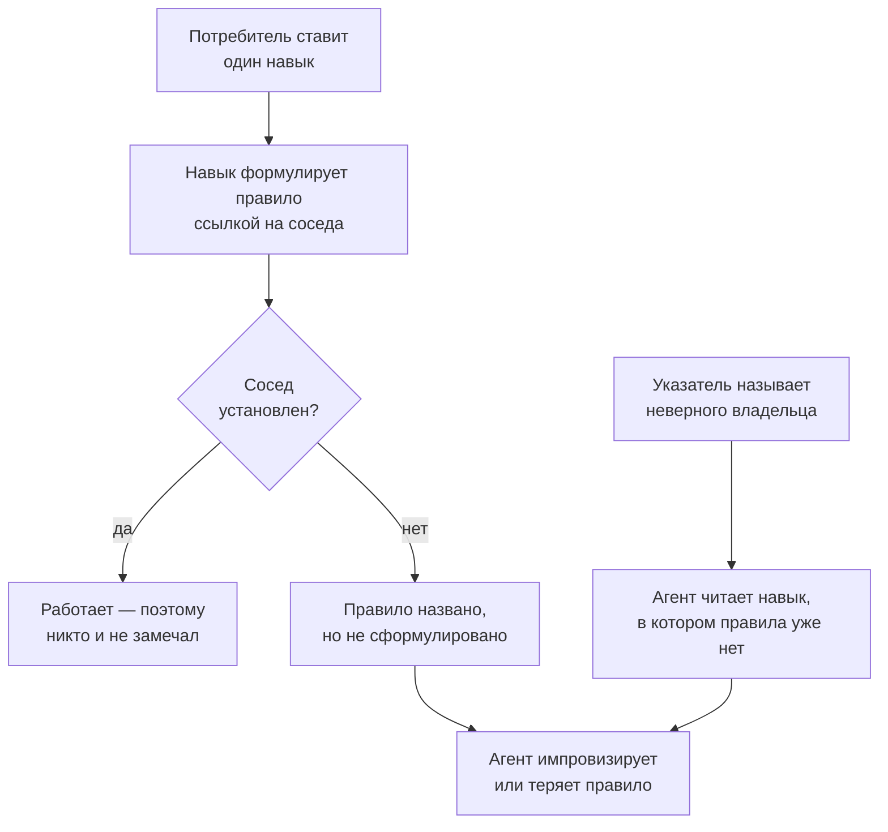

### КАК СТАЛО — как это работает теперь

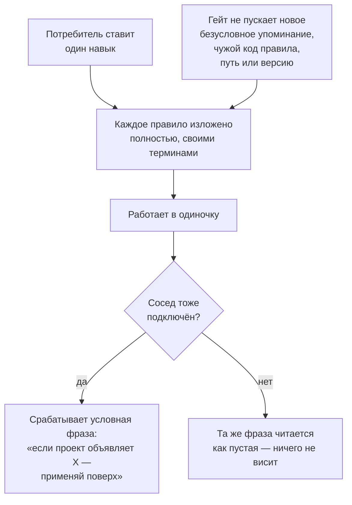

### Пример — одна и та же фраза, до и после

```text
было:  Raw `throw new Error` in domain/application is forbidden —
       typed domain errors only (see hexagonal-service error flow).

стало: Raw `throw new Error` in domain/application is forbidden —
       typed domain errors only; a foreign error is wrapped into one
       exactly once, in the driven adapter that received it, with the
       original kept as `cause`.
```

Правило теперь лежит в той коробке, которую читатель открыл. Стандарт
портов и адаптеров говорит то же самое своими словами — и это нормально;
ненормально было бы, если бы они говорили *разное*.

### Что теперь говорят навыки

- **Соседа можно назвать ровно в одной форме** — условным предложением:
  *«если проект дополнительно объявляет архитектурный стандарт, применяй
  его поверх»*. Агент действует по нему, когда подключены оба навыка, и
  игнорирует, когда нет.
- **Никогда — внутренности чужого навыка:** ни кодов правил, ни путей к
  файлам, ни имён разделов, ни закреплённых версий.
- **`typescript-nestjs` больше не решает за проект тестовые вопросы.** В
  его файле о тестах было три пересказа универсальных правил и зашитая
  школа («мокать порты» в каждом юнит-тесте); какие соседи заменяются в
  юнит-тесте — объявление проекта, и теперь файл так и говорит, оставляя
  только то, что действительно относится к NestJS.
- **`hexagonal-service` заявляет языковую нейтральность и теперь её
  соблюдает** — он больше не приводит два TypeScript-навыка в качестве
  примеров, не имея ни одного примера для других языков.

### Где правило заканчивается

- **Оно не запрещает дублирование.** Правило об оборачивании ошибок,
  правило об окружении и правило о логировании намеренно изложены в
  нескольких навыках; ревью проверяет, что копии согласованы, а не что их
  мало.
- **Оно не достаёт до записей наблюдений.** Принятое наблюдение — это
  датированный отчёт с места, который агенту править нельзя, поэтому
  записи, сделанные до этого правила, сохраняют свои формулировки. Что
  вправе сказать о соседе *новая* запись — теперь описано в `AGENTS.md`, а
  авторский `observations/INDEX.md` подпадает под гейт наравне со всем
  остальным.
- **Гейт ловит ссылки, а не пересказы.** Правило, скопированное чужими
  словами, читается как оригинальный текст; это вопрос ревью, а батарея
  анти-дублирования — страховка для него, а не замена.

---

## Навык, у которого росли уровни — и единственная граница, которую он так и не провёл

**Релизы:** проект `3.3.0` (`testing-discipline` `1.2.0 → 1.3.0`)
**Тип:** сужена область — убран один уровень, а спрятанная за ним граница получила владельца

### В одном предложении

Навык оброс третьим уровнем тестирования, который не мог обеспечить, — и при
этом единственная граница, которую его читателю реально приходится проводить
(*это юнит-тест или интеграционный?*), не была описана нигде: агенту уверенно
объясняли, как построить скелет развёртывания, и оставляли гадать про тест,
лежащий прямо перед ним.

### Проблема, точно

Две неудачи, которые выглядят не связанными и являются одной: **область навыка
задавалась тем, что успели написать, а не тем, о чём он может судить.**

| | Что предлагал навык | Что реально было нужно читателю |
|---|---|---|
| Прогон развёрнутой системы снаружи | уровень, внешний цикл, советы по деплою, правила разделения наборов | ничего — другие предметы, жизненные циклы и владельцы; у навыка тут нет полномочий |
| **Юнит против интеграции** | три уровня, каждый определён *вопросом, на который отвечает* | **где проходит граница между двумя из них** — а на это две школы отвечают по-разному |
| Лондонская школа | каталожная запись с названной ценой плюс внешний цикл, который был в основном про деплой | техника уровня юнит-теста: откуда берутся подменяемые коллабораторы |

Средняя строка — несущая. «Никогда не давай интеграционному тесту тихо
вырасти внутри юнит-набора» было правилом и раньше — и оно предполагает
границу, которую навык нигде не назвал. Хуже того, назвать её он *не может*:
Лондон проводит её структурно (любой реальный коллаборатор делает тест
интеграционным), классическая школа — поведенчески (разделяемая зависимость,
медленность или больше одной единицы поведения). Навык, выбравший одну из них,
выбрал бы школу, от выбора которой он отказывается в четырёх файлах.

### AS IS — как это ломалось

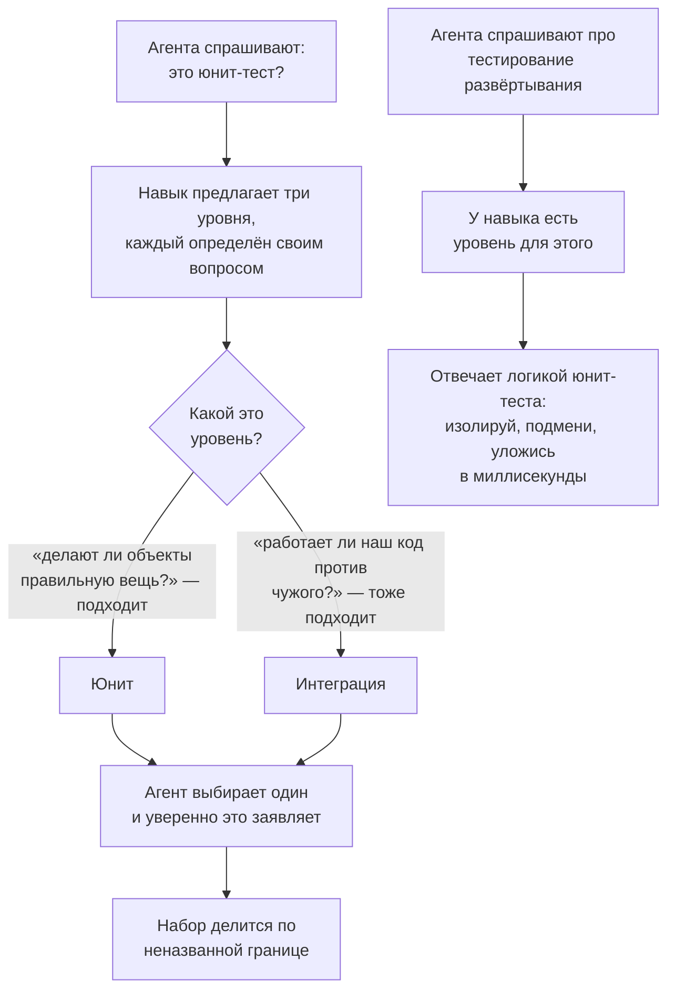

### TO BE — как это работает теперь

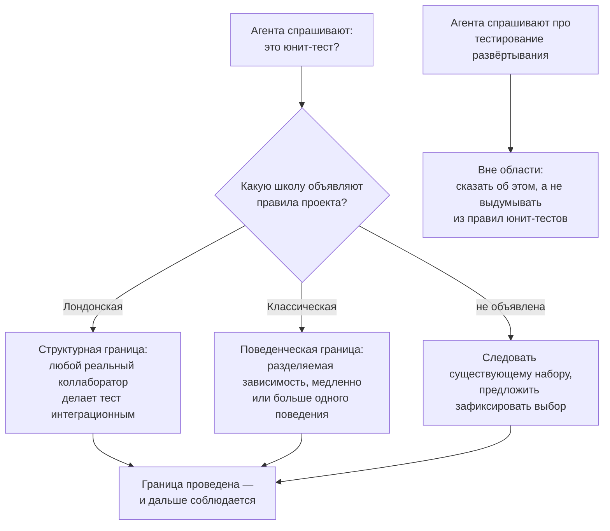

### Пример — один тест, два верных вердикта

```python
def test_a_promoted_customer_pays_the_reduced_rate():
    pricer = OrderPricer(DiscountPolicy())     # оба наши, оба настоящие
    assert pricer.total_for(an_order().promoted()) == 100 * 0.9
```

Ничего внешнего не задействовано, тест выполняется за микросекунды и прогоняет
два наших собственных класса.

- По **классической** школе это **юнит-тест**: одна единица поведения, нет
  разделяемых зависимостей, быстро.
- По **лондонской** это **интеграционный тест**: работает реальный
  коллаборатор, значит у красной полосы два подозреваемых.

Оба вердикта верны — и верны для разных проектов. До этого релиза ревьюер мог
со ссылкой на навык потребовать вынести тест из быстрого набора, а автор — со
ссылкой на тот же навык отказаться, и оба были бы правы при молчащем навыке.
Теперь файл прямо говорит, что **никакой границы уровней этот навык выдать не
может**, называет оба прочтения и указывает на объявление проекта; неизменным
остаётся одно: раз граница проведена, она соблюдается.

### Что навык говорит теперь

- **Область — юнит- и интеграционные тесты.** Это записано в `description`,
  который вызывающая сторона читает до загрузки навыка, повторено правилом,
  требующим *отказаться* от вопросов вне области, а не выдумывать ответ, и
  закрыто сканером, роняющим сборку, если третий уровень где-нибудь в навыке
  появится снова, — плюс второй тест, который подсовывает сканеру такой
  уровень, чтобы сканер не мог молча перестать работать.
- **Граница между двумя уровнями принадлежит школе, а не навыку.** Прочтение
  каждой школы выписано рядом, проект объявляет, какую границу проводит, а
  проект без объявления следует существующему набору, а не догадке.
- **Техника лондонской школы получила отдельный файл.** Коллаборатор, которого
  ещё нет, именуется от лица объекта, которому он нужен (*«если бы это
  сработало, кто бы узнал?»*), и подменыш в тесте — это то, что вызывает его к
  жизни. Интерфейсы **вытягиваются наружу от клиента, а не выталкиваются из
  реализации**; найденная поверхность держится узкой. Файл идёт вместе с ценой,
  которую эта техника создаёт, и правилами, которые её отбивают: проект,
  объявивший Лондон и пропустивший эти правила, купил цену без выгоды.
- **Цикл сужен до теста.** Правило доказательности, цикл из четырёх шагов и шаг
  refactor остаются. Работа по написанному списку тестов, выбор размера шага,
  передачи к зелёному и чем заканчивать сессию — это рабочий процесс проекта, а
  не утверждения о юнит- или интеграционном тесте, и они убраны.
- **Незаконченный красный тест остаётся в рабочей копии** до тех пор, пока не
  станет зелёным, и **красный набор не уходит в общий доступ** — это и есть то,
  к чему тянулась убранная оговорка про отдельный in-progress набор, только без
  необходимости держать ради неё целый уровень.

### Где правило заканчивается

- **Сужение области — не утверждение, что убранный материал был неверен.**
  Ходячий скелет, приёмочные циклы уровня фичи и разделение набора прогресса и
  регрессионного набора — реальные практики; они принадлежат дисциплине,
  которую этот навык не несёт, и правилам вашего проекта.
- **«Решает школа» — не значит «можно как угодно».** Граница объявляется один
  раз и дальше соблюдается ровно как раньше: юнит-тест, взявший реальное
  соединение, файл или часы, сменил уровень и переносится, переименовывается и
  получает жизненный цикл своего уровня.
- **Interface discovery применяется по объявлению.** Она работает там, где
  проект объявил лондонскую школу или дизайн через взаимодействия. При
  классической школе коллабораторы в основном настоящие, и файл не применяется
  вовсе.

---

## Тест, который никто не видел красным — и половина тестирования, которую навык не описывал

**Релизы:** проект `3.2.0` (`testing-discipline` `1.1.0 → 1.2.0`)
**Тип:** добавлена недостающая ось — все правила судили тест, но ни одно не описывало, как он появляется

### Одной фразой

Стандарт умел сказать про тест всё, кроме того, когда его писать, — а значит,
тест, который ни разу не видели падающим и который поэтому ничего не
доказывает, проходил все правила навыка.

### В чём был пробел

Разделим то, что стандарт тестирования может сказать, на две колонки. Одну
навык покрывал подробно, вторую — никак.

| Вопрос | Было покрыто | |
|---|---|---|
| Какой формы должен быть тест? | да — структура, имена, один шаг действия | ✔ |
| Что ему можно трогать и что утверждать? | да — школы, дублёры, границы | ✔ |
| Откуда берутся его кейсы? | да — из спецификации, не из артефакта | ✔ |
| **Когда тест появляется?** | **нет** | ✘ |
| **Откуда я знаю, что этот тест вообще способен упасть?** | **нет** | ✘ |
| **Какой тест писать следующим и каким шагом?** | **нет** | ✘ |
| **Что делать, когда писать тест больно?** | **нет** | ✘ |

Второй блок — не украшение. Тест это утверждение о поведении, и единственное
доказательство того, что утверждение *проверяемо*, — увиденное падение
проверки. Навык требовал падающего прогона ровно в одном месте — при
исправлении дефекта — и больше нигде, поэтому его же собственное правило «тест,
который не может упасть, ничего не защищает» осталось без процедуры.

### AS IS — как было

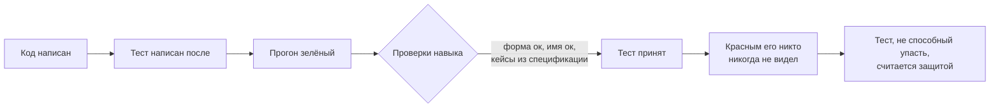

### TO BE — как стало

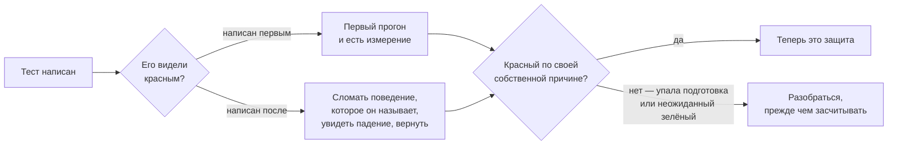

### Пример — тест, который проходит по причине, которую никто не выбирал

```python
class Expired(Exception):
    pass


class Token:
    def __init__(self, user, expires_at, now):
        if expires_at <= now:          # конструктор тоже валидирует
            raise Expired
        self.user, self.expires_at = user, expires_at


def authorize(token, now):
    if token.expires_at <= now:        # проверяемая защита
        raise Expired
    return Session(token.user)


def test_rejects_an_expired_token():
    with raises(Expired):
        token = Token("u", expires_at=YESTERDAY, now=TODAY)
        authorize(token, now=TODAY)
```

Удалите защиту внутри `authorize` целиком — тест останется зелёным: пойманное
исключение было выброшено двумя строками выше, на шаге подготовки. У теста
правильная форма, правильное имя и кейс прямо из спецификации — всё, что навык
требовал до этого релиза. Разоблачает его только наблюдение за прогоном:
написанный первым, он сразу зеленеет, а это теперь *неожиданный зелёный*,
который положено расследовать, а не считать маленькой победой; написанный
последним — остаётся зелёным при сломанной защите, а это и есть недостающее
доказательство.

### Четыре места, где новые правила выглядят как противоречие старым

Добавление процесса в стандарт об артефактах порождает столкновения. Каждая
пара ниже разделена явной границей, и каждая граница закреплена тестом:
потерять её — правдоподобная правка, после которой навык тихо противоречит сам
себе.

| Процесс говорит | Стандарт говорит | Где проходит граница |
|---|---|---|
| Дойти до зелёного, вернув константу, потом обобщить | Никогда не хардкодь значение, чтобы тест прошёл | константа попадает в **продакшн**-код и живёт недолго; хардкод происходит **в тесте** и остаётся навсегда |
| Пиши вычисление прямо в утверждении: `100 / 2 * (1 - 0.015)` | Никогда не пересчитывай ожидаемое значение алгоритмом из-под теста | вопрос в том, *чьё* вычисление: спецификации, литералами самого теста — но не продакшн-функцией и не её константой |
| Заканчивай одиночную сессию оставленным падающим тестом | Ничего сломанного, сфокусированного или пропущенного не коммитится | красный тест живёт в рабочей копии; всё, чем делишься, — зелёное |
| Классическая TDD идёт изнутри наружу | *(навык утверждал ровно это)* | это контраст с outside-in лондонской школы, а не самоописание классической: её первоисточники отвергают вертикальную метафору в пользу направления **от известного к неизвестному** |

### Что навык говорит теперь

- **Тест, который ни разу не видели падающим по его собственной причине, ещё не
  доказательство.** Бесплатно, если он написан первым; иначе — одно осознанное
  «сломать и вернуть». Важно, *какое* падение: упавшая подготовка не сказала об
  утверждении ничего. Неожиданный зелёный расследуют, а не радуются ему.
- **Цикл red/green/refactor объявляет проект**, ровно как и школу: письменный
  список тестов, по одному пункту за раз, не больше одного красного теста
  одновременно, следующий тест выбирается по тому, чему он учит, против того,
  что вы уверенно сможете сделать зелёным, вырожденный первый случай, четыре
  передачи до зелёного (очевидная реализация → один-ко-многим → триангуляция →
  подделать) с правилом переключения передач и размер шага как управляемая
  величина.
- **Тест, который трудно писать, который медленный или хрупкий, — это отчёт о
  дизайне.** Длинная подготовка, setup, не поддающийся вынесению, влияние на
  расстоянии, желание дотянуться до приватного состояния — у каждого симптома
  названо, что он говорит о коде и какое изменение просит; правило одно: сначала
  дизайн, потом тест.
- **Мелкие правила, приехавшие вместе с этим:** называй точное ожидаемое
  значение, а не свойство, которому удовлетворяют многие неверные ответы; ни
  одна константа не значит двух вещей в одном кейсе; тестируй только то, что
  написал сам, а глубину калибруй ценой ошибки; удаляй тест, только если он
  избыточен *и* по уверенности, *и* по коммуникации.

### Где правило заканчивается

- **Цикл никогда не навязывается.** Проект, который осознанно пишет тесты сразу
  после каждой функции, не делает ничего, против чего навык возражает.
  Безусловно применяется только правило про доказательство.
- **Цикл достаёт не везде.** Безопасность и конкурентность проходящими тестами
  не демонстрируются; производительность, нагрузка и удобство — отдельные виды
  работ; заранее выбранный дизайн будет удивлять; а унаследованный код без швов
  лечится ограничением объёма изменений, а не остановкой поставки.
- **Больной тест — симптом, а не диагноз.** Он обычно прав в том, что что-то не
  так, и часто ошибается в том, что именно. А если идея дизайна не приходит —
  она не приходит: проверьте состояние, зафиксируйте цену и идите дальше;
  запрещено делать это молча.

---

## «В изоляции» значит две разные вещи — и теперь выбирает проект

**Релизы:** проект `3.1.0` (`testing-discipline` `1.0.0 → 1.1.0`)
**Тип:** убрано скрытое допущение — стратегический выбор делался молча

### Одной фразой

У фразы *«юнит-тест выполняется в изоляции»* есть два устоявшихся прочтения —
изолировать юнит от его коллабораторов или изолировать тесты друг от друга, —
и стандарт тестирования молча принимал второе, поэтому любой проект, осознанно
выбравший первое, проверялся по соглашению, которого он не принимал.

### В чём именно была проблема

В справочнике по изоляции была одна фраза, которая выглядела как уточнение, а
на деле была решением:

> Изоляция — про *тест*, а не про чистоту.

Это дословно определение классической (детройтской) школы. Всё, что ревьюер
делает дальше, вытекает из него:

| Вопрос | Ответ лондонской школы (мокистской) | Ответ классической (детройтской) |
|---|---|---|
| Что изолируется? | юнит от своих коллабораторов | тесты друг от друга |
| Что такое «юнит»? | один класс | одна единица поведения — сколько бы классов ни потребовалось |
| Какие зависимости заменяются заглушкой? | каждый изменяемый коллаборатор | только совместные (на практике — внепроцессные) |
| Что считается интеграционным тестом? | любой тест с настоящим коллаборатором | медленный, совместный или покрывающий два поведения |
| В какую сторону идёт разработка через тестирование? | снаружи внутрь | изнутри наружу |

Оба столбца непротиворечивы, оба широко применяются, а стандарт был прибит к
правому — и нигде об этом не говорил. Команда из левого столбца получала
советы, противоречащие её собственному соглашению, и не могла ни на что
сослаться в стандарте, потому что выбор нигде не был предъявлен как выбор.

### КАК БЫЛО

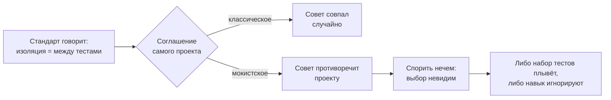

### КАК СТАЛО

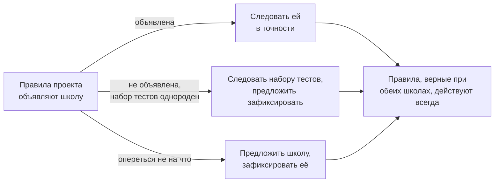

### Пример — один тест, два правильных ответа

`OrderService` вызывает `InventoryStore` — обычный класс в памяти, написанный
самой командой. Что делать с ним в юнит-тесте?

| Школа, объявленная проектом | Что делает тест | Почему |
|---|---|---|
| Лондонская (мокистская) | заменяет `InventoryStore` заглушкой | это изменяемый коллаборатор, а юнит — класс |
| Классическая (детройтская) | использует настоящий `InventoryStore` | зависимость приватная и не даёт тестам влиять друг на друга |

До этого релиза один из двух ответов молча считался неправильным. Теперь верны
оба, и вопрос только в том, какой из них проект записал у себя.

### Что теперь говорит навык

- **Школу объявляет проект, а не навык.** Каталог, словарь, в котором делается
  выбор (совместная и приватная, внутри- и внепроцессная, управляемая и
  неуправляемая, значение и коллаборатор), и порядок разрешения для проекта без
  объявления живут в навыке; само решение — нет.
- **Что должны объявить правила проекта:** школу (и границу, если она разная по
  слоям), что здесь считается юнитом, какие зависимости заменяются заглушкой,
  какие внепроцессные зависимости управляемые, а какие неуправляемые, где
  допустимо проверять взаимодействие и в какую сторону идёт разработка через
  тестирование.
- **Что верно при любой школе:** никогда не проверять взаимодействие со стабом;
  взаимодействие, не выходящее за границу приложения, — деталь реализации;
  заглушка для чужого кода пишется поверх собственного адаптера; проверку
  выходных данных предпочитают обе школы.
- Вместе со школами навык получил ту оценку, которой служат все остальные его
  правила: четыре свойства теста (защита от багов, устойчивость к рефакторингу,
  скорость обратной связи, стоимость сопровождения — перемножаются, а не
  складываются), порядок предпочтения трёх стилей проверки, ответ на вопрос,
  какой код вообще заслуживает юнит-теста, и каталог классических
  антипаттернов.

### Где правило кончается

Навык по-прежнему не выбирает школу за проект, у которого она есть, и лишь
*предлагает* её проекту, у которого её нет. Он ничего не говорит ни о раннере,
ни о библиотеке для заглушек, ни о проценте покрытия, который требует сборка.
И ничто в каталоге не разрешает проверять взаимодействие со стабом, расширять
видимость члена ради теста или пересчитывать ожидаемое значение тем же
алгоритмом, который тестируется, — это остаётся неправильным при обеих школах.

---

## Одно правило, два дома — правила тестов становятся отдельным навыком

**Релизы:** проект `3.0.0` (новый навык `testing-discipline` `1.0.0` ·
`python-coding` `1.4.0 → 1.5.0` · `typescript-coding` `1.6.0 → 1.7.0`)
**Тип:** убрано дублирование — одно и то же правило поддерживалось дважды

### Одной фразой

Как писать тест — это свойство тестов, а не языка программирования, но каждый
языковой стандарт нёс собственную полную копию этих правил, поэтому любое
исправление приходилось делать дважды, вручную и в двух разных релизах.

### В чём именно была проблема

Три последних исправления правил тестирования сначала попадали в один
стандарт, а потом их приходилось зеркалить во второй:

| Какое правило исправляли | Сначала | Зеркалили потом |
|---|---|---|
| Откуда берутся набор кейсов, предмет теста и его измерения | проект `2.5.0` | проект `2.6.0` |
| Как устанавливается контракт заглушки для внешней системы | проект `2.7.0` | проект `2.8.0` |
| Подстановка значений на выходе из вызова и кто собирает коллаборатора | проект `2.9.0` | проект `2.10.0` |

Шесть релизов на три правила. Ни одно из них не было привязано к языку: у
каждого была собственная проверка универсальности, а зеркальная копия
отличалась только тем, какая библиотека упоминалась в примере. Дело даже не в
удвоенной работе — две копии могли разойтись, а третьему языку понадобилась бы
третья копия всего этого.

### КАК БЫЛО

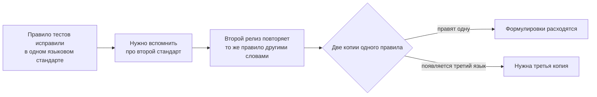

### КАК СТАЛО

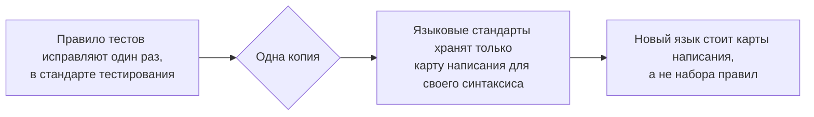

### Пример — что переехало, а что осталось

Само правило и его воспроизведение нейтральны к языку, поэтому они переехали:

> Возвращаемые значения заглушки, когда проверяемое свойство принадлежит
> внешней системе, устанавливаются одним наблюдением этой системы, а не
> чтением документации.

В языковом стандарте осталась только лексика, которой это выражают, — строка
таблицы, а не правило:

| Что нужно тесту | Остаётся в языковом стандарте |
|---|---|
| Подстановка для шва, которым владеет проект | какая конструкция удовлетворяет объявленному интерфейсу |
| Патчинг как крайняя мера | какое средство патчинга и что оно требует обоснования |
| Пропуск теста, который всё-таки уезжает | какой маркер несёт причину |
| Отрицательное утверждение на уровне типов | какое подавление контролирует сам чекер |

### Что теперь говорят навыки

- `testing-discipline` владеет правилами: тесты едут вместе с изменением, один
  сценарий на тест, изоляция и внедрённое время, что можно подменять и чем
  обосновывается контракт заглушки, сбор свидетельств там, где живёт свойство,
  откуда берутся кейсы, гигиена набора тестов.
- `python-coding` и `typescript-coding` держат по карте написания и больше не
  формулируют собственных правил тестирования.

### Где правило кончается

Стандарт тестирования ничего не говорит о том, какой раннер брать, где лежат
файлы тестов и какого покрытия требует сборка, — это дело проекта. Какого
коллаборатора и на каком шве подменять в ports-and-adapters-сервисе — по-прежнему
дело `hexagonal-service`, а как правило записывается на конкретном языке — дело
стандарта этого языка.

---

## Чего заглушка всё ещё не видит — ещё две формы того же слепого пятна

**Релизы:** проект `2.10.0` (`typescript-coding` `1.5.0 → 1.6.0`) · проект
`2.9.0` (`python-coding` `1.3.0 → 1.4.0`)
**Тип:** пробел расширен — формулировка предыдущего исправления оказалась узкой

### Одной фразой

Правило про подмену стороннего шва говорило: «**возвратные значения** заглушки
устанавливаются наблюдением за реальной системой» — но заглушка может также
не заметить значение, которое реальная система меняет **на выходе** вызова, и
не заметить, строит ли **сам продукт** объект-соучастник так, как заглушка
предполагала.

### В чём именно был пробел

Предыдущая запись исправила *то, как возвратные значения заглушки становятся
достоверно известными*. Её собственная формулировка, при буквальном чтении,
покрывает только случай, когда заглушка вычисляет неверный **выход** для
данного входа. Две смежные формы остаются вне этой формулировки при первом
прочтении:

1. **Возврата вообще нет.** Некоторые сторонние клиенты подменяют значение,
   которое вызывающая сторона не полностью контролирует, — идентификатор
   запроса, токен повтора, заголовок по умолчанию — на выходе из вызова, до
   того как что-либо возвращается. Заглушка, привязанная ровно к этому слою,
   не имеет возвратного значения для проверки, поэтому формулировка «проверь
   возвратное значение» не предупреждает читателя.
2. **Заглушка построила объект сама.** Тест, проверяющий *как* строится
   соучастник — какие аргументы, какие перехватчики, — иногда строит этого
   соучастника вручную внутри теста, вместо вызова той единственной
   продакшен-фабрики, которая строит его по-настоящему. Такой тест доказывает,
   что свойство *достижимо*; он не доказывает, что его достигает *продукт*.

### КАК БЫЛО — как это ломалось

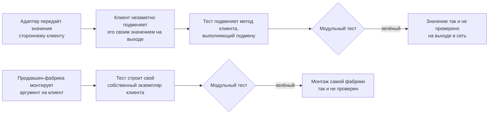

Обе петли устроены одинаково: доказательства, которые собирает тест, взяты не
там, где на самом деле находится проверяемое свойство.

### КАК СТАЛО — как это работает теперь


### Пример, который можно прокрутить в голове

Тест, подменяющий стороннего клиента:

```python
monkeypatch.setattr(sdk.chat, "completions", fake_domain)
assert request.trace_id == "t-1"          # верно — но никогда не проверено
```

Это проверяет только то, что *передал* вызывающий код. Ничего не говорится о
том, что SDK сделал со значением дальше — а тот SDK безусловно перегенерировал
собственный идентификатор при каждом вызове. Заглушка подменила ровно тот код,
который мог бы это показать.

Случай с монтажом ещё короче: функция-фабрика — единственное место, где клиент
собирается по-настоящему; каждый тест строит свой параллельный клиент. Удалите
аргумент из вызова фабрики — и весь набор тестов, каждый файл, останется
зелёным, потому что ни один из них фабрику не вызывает.

### Те же две формы, на другом языке

Ни одна из форм не принадлежит Python. Оба правила есть и в стандарте
TypeScript, пересказанные в инструментах, которыми пользуется Node-проект:

```ts
const send = jest.fn();
client.send = send;
expect(send.mock.calls[0][0].traceId).toBe("t-1");  // что передали — но не то, что ушло
```

```ts
createClient({ interceptors: [logging] });     // единственное место, где продукт строит клиент
new SdkClient({ interceptors: [logging] });    // а вот что строит каждый тест
```

Объект опций вместо именованных аргументов, массив перехватчиков вместо списка —
тот же шов сборки и тот же вопрос: проверяется ли то, что действительно
поставляется?

### Что теперь говорит навык

| Правило | Простыми словами |
|---|---|
| Подмена на выходе тоже считается | Заглушку нужно проверять и на значение, которое реальный слой меняет на выходе, а не только на то, что она возвращает — возвратного значения для проверки может не быть вовсе |
| Монтаж — тоже путь кода | Тест, проверяющий, как собран соучастник, должен выполнять продакшен-фабрику, а не собранную вручную копию — вручную собранная копия доказывает достижимость свойства, а не то, что его достигает продукт |

### Где правило кончается

Ни одно из дополнений не выходит за пределы своей формы. Заглушка для шва,
которым владеет сам проект, без вызова наружу, первым правилом не затрагивается.
Тест, вызывающий настоящую продакшен-фабрику напрямую — а не её замену, — уже
удовлетворяет второму правилу; от него не требуется ничего сверх этого. Оба
дополнения несут отдельный негативный тест, чтобы их не применяли шире, чем
нужно.

### Как делалось изменение

Сначала тест: регрессия, фиксирующая два новых правила и обе их
воспроизводимости, была написана и подтверждённо красной на тексте до
изменения → добавлено минимальное руководство → регрессия стала зелёной →
добавлены два `behavior`- и два `negative`-кейса оценки, по паре на форму →
весь набор тестов прошёл без регрессий.

---

## Откуда заглушка берёт правду

**Релизы:** проект `2.8.0` (`typescript-coding` `1.4.0 → 1.5.0`) · проект
`2.7.0` (`python-coding` `1.2.0 → 1.3.0`)
**Тип:** закрыт пробел — навык не ошибался, он молчал

### Одной фразой

Навык говорил, **что** подменять заглушкой в модульном тесте, но не говорил,
**откуда берутся ответы самой заглушки**, — поэтому заглушка могла хранить
неверное представление о чужой системе, а тест оставался зелёным сколько угодно
долго.

### В чём именно был пробел

В `references/testing.md` уже было хорошее правило:

> подменяй протоколы и стыки, которые код открывает сам, а не чужие внутренности

Это правило про **форму** заглушки. Про её **содержимое** — про значения,
которые она возвращает, — там не было ничего. А когда эти значения описывают
систему, которую ваш проект не писал (брокер сообщений, драйвер базы, кодировщик
аутентификации), верить им — акт веры, и навык об этом не предупреждал.

### КАК БЫЛО — как это ломалось


Самое вредное здесь — петля. Заглушка проверяет сама себя: если она врёт, тест
врёт вместе с ней и остаётся зелёным через любое число раундов правок. Каждый
раунд рождал **новое прочтение** той же документации, а новое прочтение — ровно
то единственное, что не могло закрыть вопрос.

### КАК СТАЛО — как это работает теперь

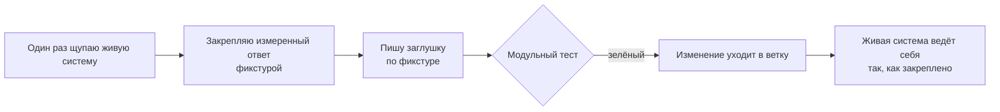

Одно живое наблюдение заменяет неограниченное число прочтений.

### Пример на две строки

Соединение открыто драйвером `psycopg` с фабрикой строк `dict_row`:

| Запрос | Что драйвер возвращает на самом деле |
|---|---|
| `SELECT true AS a, false AS b` | `{"a": True, "b": False}` — два ключа |
| `SELECT true, false` (без псевдонимов) | `{"?column?": False}` — **один** ключ, колонки схлопнулись |

Что было написано в тесте:

```python
cursor.fetchone.return_value = (True, False)   # обычный кортеж DB-API
```

Именно так подсказывает любой учебник по DB-API — и именно это неверно для
соединения с `dict_row`, потому что `dict_row` выбрала библиотека, а не проект.
Тест проходил. Живой запрос падал с
`ValueError: not enough values to unpack`.

Второй пример, такой же короткий:

```python
yarl.URL.build(scheme="amqp", host="h", port=1, user="", password="p").user
# -> None
```

Пустой пользователь неотличим от отсутствующего, поэтому любая клиентская
библиотека, читающая такой URL, вправе подставить собственную личность по
умолчанию. Никакая заглушка на стыке самой обёртки этого не увидит — заглушка
как раз и стоит вместо того слоя, который подставляет.

### Те же два факта на другом языке

Ничто из этого не принадлежит Python. То же правило вошло и в стандарт
TypeScript — с теми же двумя примерами, пересказанными инструментами Node:

```ts
new URL("amqp://:p@h:1").username;  // "" — ровно как и new URL("amqp://h:1").username
```

| Как выглядит запрос | Что вернёт драйвер, собирающий строки объектами |
|---|---|
| `SELECT true AS a, false AS b` | `{ "a": true, "b": false }` — два ключа |
| `SELECT true, false` (без псевдонимов) | `{ "?column?": false }` — **один** ключ: база называет обе колонки `?column?`, и вторая затирает первую |

Язык поменялся, урок — нет. В этом и суть: правило про то, откуда берётся
убеждение, а не про синтаксис.

### Одна и та же ошибка, три раза подряд

| № | Чужая система | Во что верила заглушка | Как на самом деле |
|---|---|---|---|
| 1 | брокер сообщений через `aio-pika` | имя события можно взять из ключа маршрутизации | брокер **переписывает** ключ доставки на каждом переходе в очередь недоставленных, а тип сообщения проносит неизменным |
| 2 | `aiormq`, SASL-PLAIN | «непустая строка в настройках = логин задан» | пустой пользователь считается отсутствующим, и кодировщик подставляет личность по умолчанию слоем ниже проверяемого стыка |
| 3 | `psycopg`, `dict_row` | курсор отдаёт кортеж | колонки без псевдонимов схлопываются в отображение с одним ключом |

Три разные библиотеки, три независимых случая, одна общая причина: убеждение о
поведении чужой системы **предположили**, а не **измерили**. Каждый случай
закрыла живая проба. Ни один не закрыло чтение.

### Что теперь говорит навык

| Правило | Простыми словами |
|---|---|
| Наблюдение, а не чтение | Для чужой системы значения заглушки устанавливаются одной пробой живой системы — не из документации вендора и не из нормы проекта |
| Сначала проба, потом заглушка | Заглушку пишут только после того, как проба закрепила поведение; закреплённый результат дальше переиспользуют фикстурой |
| **Триггер второго отказа** | Если одно и то же прочтение одного и того же чужого свойства отвергли дважды — перестань читать. Смени класс доказательства: иди и померь. Третьего прочтения не бывает |

### Где правило кончается

Оно про системы, **которыми вы не владеете**. Заглушка для порта, который
определил ваш собственный проект, — совсем другой случай: там контракт и есть
решение проекта, и прочитать его — правильный способ его узнать. В изменение
входит отдельный негативный тест, чтобы правило не растянули и на этот случай.

### Как делалось изменение

Строго тестом вперёд: сначала написан регрессионный тест на новую формулировку и
подтверждено, что он по-настоящему красный (падали 4 утверждения из 5) → добавлен
блок правил → тест позеленел (5 из 5) → добавлены два оценочных кейса, один на
поведение и один против ложного срабатывания выше → полный прогон 684 из 684 без
регрессий.

---

## Откуда тест берёт свои случаи

**Релизы:** проект `2.5.0` (`python-coding` `1.1.0 → 1.2.0`) · проект
`2.6.0` (`typescript-coding` `1.3.0 → 1.4.0`)
**Тип:** закрыт пробел — одна история, два языка, два релиза

### Одной фразой

Навык проверял **качество** теста — красный до фикса, детерминированный — но
молчал о том, **откуда берутся случаи** для проверки. Поэтому случаи списывали с
проверяемого кода вместо того, чтобы выводить их из спецификации, и тест с кодом
ошибались в одну сторону, всё время соглашаясь друг с другом.

### В чём именно был пробел

Ближайшее существовавшее правило звучало так:

> Не подгоняй тест под гейт: никогда не зашивай ожидаемое значение, «чтобы
> прошло».

Оно не покрывает ничего из случившегося. Ничего не зашивали «чтобы прошло» —
каждый случай был честно красным до своего фикса. Не хватало трёх других вещей:
**откуда берутся случаи**, **что является предметом теста** и **какие измерения
он обязан варьировать**.

### КАК БЫЛО — как зелёный набор оставался слепым

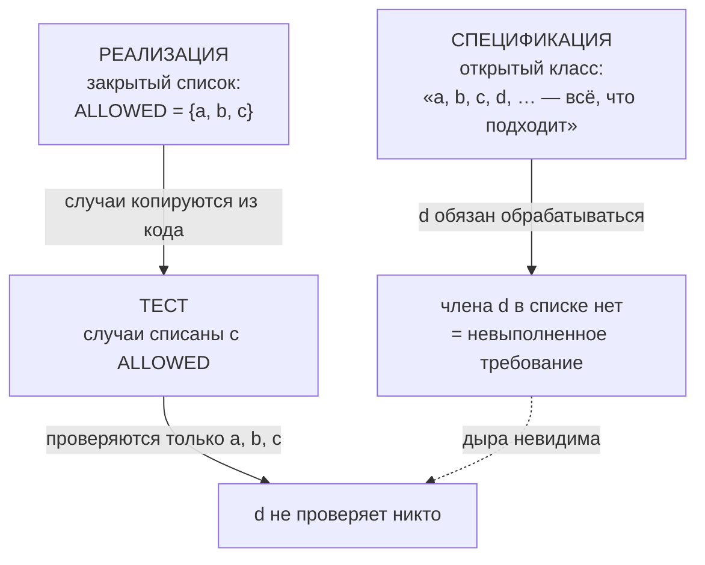

И ловушка захлопывается: **мутационное тестирование здесь не спасает.**
Мутируешь `ALLOWED` в коде — вместе с ним мутирует и тест, списанный с
`ALLOWED`, он краснеет, мутант убит, скор «здоровый». А в строгой форме, где
тест **импортирует** перечисление вместо копии, мутация даже не падает. Здоровый
мутационный скор — не доказательство покрытия спецификации.

### КАК СТАЛО — как это работает теперь

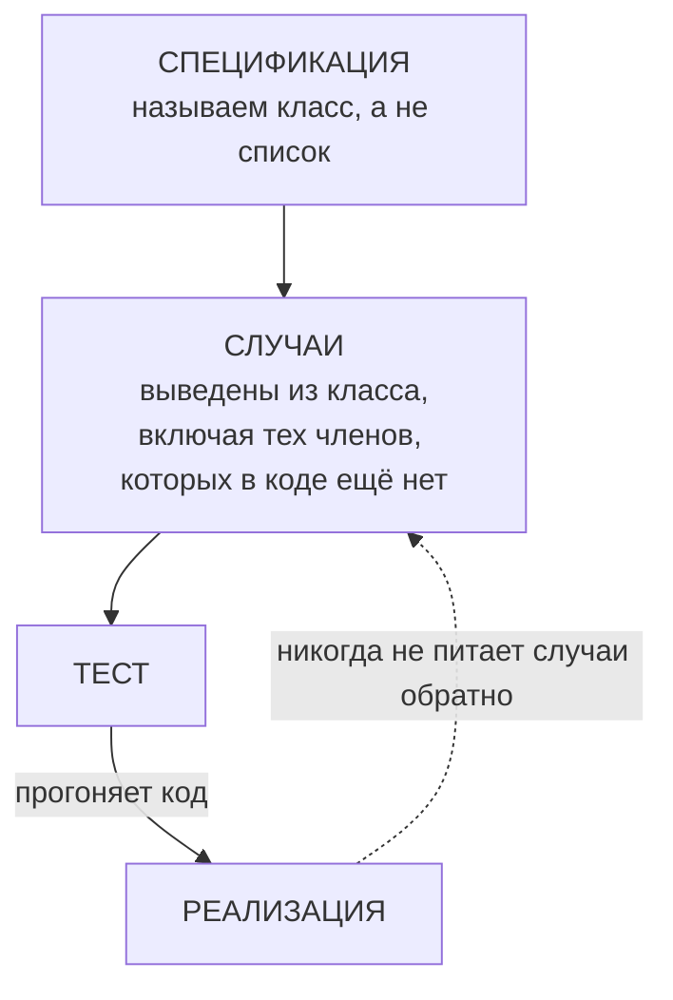

Стрелка от реализации к случаям — ровно та, которой быть не должно.

### Пример, который умещается в голове

```python
ALLOWED = {"totalTokens", "inputTokens", "outputTokens"}   # код

@pytest.mark.parametrize("field", ALLOWED)                 # тест
def test_field_is_handled(field): ...
```

Спецификация говорит «любое поле со счётчиком токенов». Код знает три. Тест
спрашивает у кода, какие именно три. Четвёртое реальное поле —
`totalTokenCount` — не обрабатывает никто, и ни один прогон этого набора об этом
не скажет. В TypeScript форма та же: реестр `as const` и `it.each(ALLOWED)` по
нему.

### Три правила, которые добавили

Они идут одной семьёй под общим тезисом: **набор случаев теста, его предмет и
его измерения выбираются из спецификации, а не из проверяемого артефакта.**

| Правило | Простыми словами | Какую ошибку закрывает |
|---|---|---|
| **1. Происхождение набора случаев** | Выводи случаи из класса, названного спецификацией; никогда не копируй список из кода и не параметризуйся по нему | Набор способен подтвердить только то, что код и так знает |
| **2. Предмет при слоистой защите** | Заявка «защита в несколько слоёв» не доказана, пока каждый слой не пройден на пути, где он — **единственная** защита | Один сквозной тест через два слоя не доказывает ничего ни об одном |
| **3. Тотальность по измерениям** | Назови измерения, которые различает защитник, и требуй хотя бы один случай на измерение; выживший мутант — признак недостающего **измерения**, а не просто случая | 11 случаев на 11 имён покрывают одно измерение одиннадцать раз |

Правило 2, нарисованное:

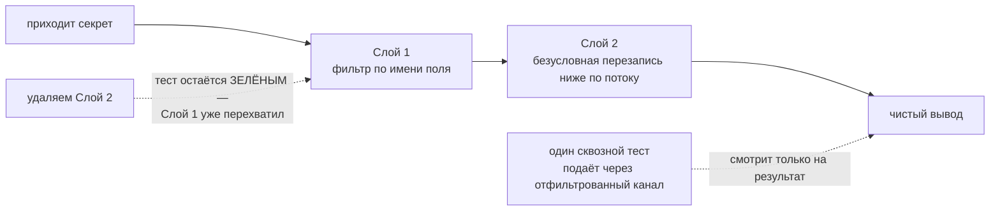

Правило 3 в цифрах — измеренных, а не заявленных: набор из **303 зелёных**
тестов превратился в **11 упавших** в тот момент, когда добавили единственный
случай, варьирующий **форму** ключа (сырая против нормализованной), а не его
текст. Одиннадцать настоящих дыр, одно недостающее измерение.

### До чего дошло, пока никто не замечал

Девять независимых вхождений в одной сборке за тринадцать раундов правки. Каждое
нашла живая проба или мутационная батарея — **ни одного не нашёл набор тестов**,
который и должен был стеречь это свойство: он оставался зелёным на 133, 247,
251, 276, 303, 320 и 310 проходящих тестах, пока реальные дефекты шли насквозь.

Решающая улика, что это отсутствующее правило, а не невнимательный автор: два
вхождения из девяти появились **внутри той самой правки, которая чинила
третье** — паттерн воспроизвёлся в лекарстве от самого себя, в раунде, автора
которого только что предупредили, и чей тест-файл называет паттерн вслух.

### Где правило кончается

Правило 3 — про входы, которые защитник действительно различает. Входу с одним
настоящим измерением хватает случаев на одно измерение и не больше; в изменение
входит отдельный негативный тест, чтобы правило не превратилось в требование
обрядовых случаев.

### Как делалось изменение

Тестом вперёд, оба раза: сначала регрессионный тест на новую формулировку,
подтверждённо красный (падали 5 утверждений из 6) → добавлен блок правил →
зелёный → оценочные кейсы, по одному на правило плюс страж от ложного
срабатывания. Полный прогон: 673 из 673 для Python-релиза и 679 из 679 для
TypeScript-релиза, без регрессий. TypeScript-половина — сознательное зеркало: те
же три правила, примеры пересказаны идиомами TypeScript (реестр `as const`,
`it.each`, `Map` с нормализацией ключей, исчерпывающий `switch` по дискриминанту
как второе измерение).
